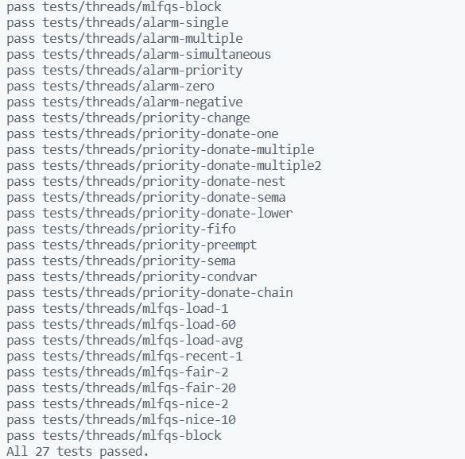

**CSED312 OS Lab 1 - Threads**
================

**Final Report**
----------------

<div style="text-align: right"> 20180085 송수민 20180373 김현지 </div>

------------------------------

# **I. Implementation of Alarm Clock**

## **Analysis**

Alarm Clock이란 Thread가 Sleep상태일 때, 이를 깨워 Running state로 만드는 기능이다. 현재 구현 된 Alarm  Clock을 보자.

```cpp
void timer_sleep (int64_t ticks) 
{
    int64_t start = timer_ticks ();
    ASSERT (intr_get_level () == INTR_ON);
    while (timer_elapsed (start) < ticks) 
    thread_yield ();
}
```

>현재 구현되어 있는 timer_sleep이다. 여기서 start는 컴퓨터가 부팅되면서 작동한 timer의 값이다. Timer_elapsed는 timer_sleep이 시작 된 시간을 현재의 시간에서 빼주는 값을 return하는 함수이다. 즉, timer_sleep이 얼마나 실행되었는지 알 수 있는 함수이다. 이 값을 ticks와 비교해 ticks가 되기 전까지 계속 일어날 Thread가 있는지 확인하는 구조인 것이다. 이는 매번 일어날 Thread가 있는지 확인하여야 하고 이를 위해 지속해서 loop가 작동하기 때문에 비효율적이다. 이를 Busy-Waiting 방식이라 한다

## Brief Algorithm

Timer_sleep이 실행되면 thread_sleep()에서 thread가 일어날 시간을 Parameter로 넘겨 이를 기억한다. 이후, 해당 thread를 Block 처리하고 sleep_list에 넣는다.. 일어날 시간이 되면 다시 thread를 unblock처리하고, sleep_list에서 지운다.

## Implementation

- Thread가 일어날 시간을 담는 Variable을 추가하였다.
```cpp
 //threads/thread.h
struct thread
{
    …
    int64_t WakeUpTicks;
};
```

- 자고 있는 thread들을 담기 위한 list를 전역으로 선언하고, 초기화하였다. 이는 다른 ready_list, all_list와 같은 방식을 착안한 것이다.

```cpp
 //threads/thread.c
static struct list sleep_list;
…

void thread_init()
{
    …
    list_init(&sleep_list);
}
```

- Thread를 Sleeping Thread로 만드는 것의 첫 부분이다. 

```cpp
void timer_sleep (int64_t ticks) 
{
    int64_t start = timer_ticks ();
    ASSERT (intr_get_level () == INTR_ON);
    /*while (timer_elapsed (start) < ticks) 
    thread_yield ();*/
    thread_sleep(start+ticks);
}
```

>이때 thread_sleep(ticks) 를 호출 하는데, timer_sleep에서 thread_sleep에 넘겨주는 start+ticks는 Sleeping 처리될 thread가 후에 일어날 시간이다. Start = timer_ticks()로 assign 되어 있는데, timer_ticks()는 현재 ticks를 return 해주는 method이다. 따라서, 현재 시간에 Sleeping tick를 더하면 일어날 시각의 정보가 만들어 지는 것이다. 이렇게 하면, 매번 인터럽트가 일어날 때마다 깨우는게 아니라, 위 정보를 이용하여 일어날 thread만 처리 할 수 있으니 기존의 방식보다 효율적이다.

<br>

- Timer_sleep에서 일어날 시각을 전해주었으니 이를 바탕으로 현재 thread를 sleeping status로 변환해주는 method를 작성하였다. 

```cpp
void thread_sleep(int64_t ticks) // ticks : thread가 일어날 시간
{
    struct thread *cur = thread_current();
    ASSERT(cur!=idle_thread);
    enum intr_level old_level;
    old_level = intr_disable();
    cur->WakeUpTicks = ticks;
    list_insert_ordered(&sleep_list,&cur->elem,CompareWakeUpTick,NULL);
    thread_block();
    intr_set_level(old_level);
}
```

> 이때 Thread_sleep에서 넘겨 받는 ticks는 thread_current()가 일어날 시각이다. Thread pointer로 현재 thread를 받아오고, thread를 block처리 할 때 인터럽트가 발생하면 안되므로, 인터럽트를 해제하여 준다. 현재 thread info에 WakeUpTicks에 일어날 시각을 assign하고, 전역으로 선언한 sleep_list에 WakeUpTicks가 작은 것이 list에 앞으로 오도록 넣어준다. 넣어주는 방법은 내제되어 있는 method인 list_insert_ordered를 사용하였고, 비교 함수는 CompareWakeUpTick을 새로 선언 및 정의 하였다. 이는 후술 하도록 한다. 이후, 이 thread는 일정 시간동안 Sleeping, 즉 ready state가 아닌 Block state가 되어야 하므로 thread_block을 처리하여주고, 인터럽트를 다시 받아들일 수 있게 처리해준다.

<br>

- 위에서 언급한 WakeUpTicks를 비교하여 boolean 값을 넘겨주는 method를 작성하였다.
  
```cpp
bool CompareWakeUpTick(struct list_elem *sleep_elem, struct list_elem *slept_elem, void *aux)
//sleep_elem:잘 Thread, slept_elem:자고있는 이미 list 안에 있는
{
    return list_entry(sleep_elem,struct thread, elem)->WakeUpTicks
            < list_entry(slept_elem,struct thread,elem)->WakeUpTicks;
}
```

> list_insert_ordered에서 반복문을 통해 slept_elem을 앞에서부터 탐색한다. 앞에서부터 탐색하다가, 일어나는 시각의 값이 sleeping 처리 할 thread보다 큰 순간에 true를 return하고, list_insert를 실행한다. 크거나 같은 것이 아니라, 큰 순간 true를 return하는 이유는 만약 일어나는 시간의 값이 같은 thread가 이미 들어가 있었다고 가정해보자. 이 thread 앞에 sleeping thread를 넣어버리면 먼저 sleep_list에 들어왔음에도 불구하고 자신이 일어날 차례에 일어나지 못한다. 한 개의 thread가 그런일이 발생하였다면 문제가 적겠지만, 여러 개의 thread가 동일한 상황이 발생한다면, 제일 먼저 들어온 thread는 실행 되지 않을 수도 있다. 이러한 Starvation을 방지하기 위해 부등호를 초과로 설정한다.

<br>

- booting이후 해당 ticks에 일어나야할 thread가 있다면 깨우는 thread_wakeup함수를 호출한다.

```cpp
static void timer_interrupt (struct intr_frame *args UNUSED)
{
    ticks++; //Since OS booting.
    thread_tick ();
    if(!thread_mlfqs){
    thread_wakeup(ticks);//OS BOOT이후 TICKS와 비교
    ...
}
```

>다음은 일어날 thread를 Wakeup 처리하는 과정이다. 먼저 Timer_interrupt를 보자. 컴퓨터가 booting되고 나서 ticks는 계속 증가한다. 첫번째 줄의 ticks는 전역으로 선언되어 있는 booting되고 나서의 시간을 가지고 있는 ticks이다. 이후, interrupt가 발생하면 thread_wakeup을 호출한다. 이때, 넘겨주는 ticks는 WakeUpTicks와 비교하기 위해 넘겨준다.


<br>

- thread가 일어날 시간이 되면 깨우는 즉, thread의 WakeUpTick이 boot이후 tick과 같아질 때 깨우는 함수를 작성하였다.
  
```cpp
void thread_wakeup(int64_t ticks)//이 ticks는 boot되고 나서의 지난 시각을 의미함
{
    struct list_elem *it = list_begin(&sleep_list);
    while(it!= list_end(&sleep_list))
    {
        struct thread *cur = list_entry(it,struct thread, elem);
        if(cur->WakeUpTicks > ticks) break; // 아직 일어날때가 아니기 때문에 break하고 함수 out.
        it= list_remove(it);
        thread_unblock(cur);
    }
}
```

>Thread_wakeup에서 sleep_list의 가장 앞의 thread의 일어날 시각이랑 현재 시각(ticks)를 비교하여 WakeUpTicks가 더 크면 아직 그 시각까지 도달하지 못한 것이므로 깨우지 않고, 그 반대라면 일어날 시각이므로 list에서 해당 thread를 지우고 unblock처리하여 ready status로 만들어준다.
위와 같은 Logic으로 Sleeping 처리 함과 동시에 Block status로 만들고, 일어날 시간에 Unblock처리를 하여 Ready status로 만들어 Busy-wait에 비해 CPU Cycle을 효율적으로 줄일 수 있다.

</br></br></br></br></br></br></br></br></br></br></br></br>
</br></br></br></br></br></br></br></br></br></br></br></br>

# **II. Implementation of Priority Scheduling**

## **Analysis**

현재 구현되어 있는 thread 구조체에 member 변수로 priority가 있다. 이를 어떻게 사용하는지 알아보기 위해 Scheduling이 실행되는 yield, unblock 함수를 살펴보자.

```cpp
void thread_unblock (struct thread *t) 
{
    enum intr_level old_level;
    ASSERT (is_thread (t));
    old_level = intr_disable ();
    ASSERT (t->status == THREAD_BLOCKED);
    list_push_back (&ready_list, &t->elem);
    t->status = THREAD_READY;
    intr_set_level (old_level);
}  

void thread_yield (void) 
{
    struct thread *cur = thread_current ();
    enum intr_level old_level;
    ASSERT (!intr_context ());
    old_level = intr_disable ();
    if (cur != idle_thread) 
        list_push_back (&ready_list, &cur->elem);
    cur->status = THREAD_READY;
    schedule();
    intr_set_level (old_level);
}
```

list_push_back을 통해, priority는 고려하지 않고 들어오는 순서대로 ready_list에 뒤에 넣는 것을 볼 수 있다. 이제 Priority를 고려하여 ready_list에 넣고자 한다.

## **Brief Algorithm**

Scheduling시에 Priority를 고려하여 ready_list에 넣는다. 또한, thread를 create하거나 priority를 재설정 하였을 때 현재 실행되고 있는 thread의 priority와 비교하여 더 높다면 즉시 yield한다.

</br></br></br></br></br></br></br></br>

## **Implementation**

-Scheduling시 ready_list에 넣는 과정이 있는 method들에, list_push_back 대신 list_insert_ordered 사용하여 element를 list에 넣도록 구현하였다.
```cpp
void thread_unblock (struct thread *t) 
{
    enum intr_level old_level;
    ASSERT (is_thread (t));
    old_level = intr_disable ();
    ASSERT (t->status == THREAD_BLOCKED);
    list_insert_ordered(&ready_list, &t->elem, thread_comparepriority, NULL);
    //list_push_back (&ready_list, &t->elem);
    t->status = THREAD_READY;
    intr_set_level (old_level);
}
void thread_yield (void) 
{
    struct thread *cur = thread_current ();
    enum intr_level old_level;
    ASSERT (!intr_context ());
    old_level = intr_disable ();
    if (cur != idle_thread)
        list_insert_ordered(&ready_list, &cur->elem, thread_comparepriority, NULL); // 0924
        //list_push_back (&ready_list, &cur->elem);
    cur->status = THREAD_READY;
    schedule ();
    intr_set_level (old_level);
}
```

> 기존에는 list_push_back으로 먼저 들어온 thread가 별도의 priority에 관한 순서 없이 실행이 되게 설계가 되어 있었는데, 이를 priority를 기준으로 정렬되게 list_insert_ordered로 대체하여 준다.

- 이때, Alarm-clock에서 사용하였던 비교함수처럼 thread_comparepriority를 선언 및 정의하여 사용한다. 이 함수에 관한 내용은 뒤에 후술한다. 그 외 변경사항은 없다.

```cpp
bool thread_comparepriority(struct list_elem *thread_1, struct list_elem *thread_2, void *aux)
{
    return list_entry(thread_1, struct thread, elem)->priority > list_entry(thread_2, struct thread, elem) -> priority;
}
```

>전체적인 Logic은 비슷하나, priority가 큰 entry가 앞에 위치하여야 하기 때문에 부등호가 반대로 바뀌었다. 또한, 위에 서술한 동일한 이유로 등호는 붙이지 않는다.

</br></br>

- Priority를 고려하여 줄 상황이 2가지 더 존재한다. Priority를 재설정하거나, thread를 create하여 새로운 thread와 기존의 thread들 간의 prioirty를 비교해줄 필요가 있는 상황이다. thread_create와 thread_set_priority에서 나타나며, thread_compare()가 필요한 상황에 함수를 호출하였다.

```cpp
void thread_set_priority (int new_priority) {
    struct thread *thrd_cur = thread_current();
    if(!thread_mlfqs){
        thrd_cur->origin_priority = new_priority;
        reset_priority(thrd_cur);
        thread_compare(); // priority설정 후, priority에 따라 thread yield
    }
}
tid_t thread_create (const char *name, int priority, thread_func *function, void *aux) {
    …
    thread_unblock (t); // Thread 생성완료 직전, Unblock하여 Ready Queue에 넣는다.
    thread_compare();
    return tid;
}
```

>먼저, thread_set_priority를 보면 thread_compare()를 볼 수 있다. 위 2줄은 priority donation을 위한 code 구현으로 뒤에서 설명한다. 대략적으로 설명하면, 현재 thread의 priority를 재설정한다. 재설정 후에 기존 thread ready_list에 있는 thread가 재설정된 priority보다 크다면 바로 해당 thread에 yield해주어야 한다. 이는 thread_compare()에서 실행한다. 이 함수는 바로 뒤에 설명한다. Thread_create()도 같은 맥락으로 새로운 thread가 생성되었으므로 생성된 thread의 priority와 기존 thread들의 prioirity를 비교하여 생성된 thread의 priority가 더 크다면 바로 이 thread에 CPU를 내주어야 한다.

- 현재 thread와 ready_list의 top thread와 비교하여 ready_list에 있는 thread의 priority가 더 크다면 thread_yield를 호출 함수를 구현하였다.

```cpp
void thread_compare() { //create될때랑 priority 재설정 할때.
    if(!list_empty(&ready_list) && (thread_current()->priority < list_entry(list_front(&ready_list),struct thread, elem)->priority))
        thread_yield();
}
```

>Thread_compare에서 현재 thread와 ready_list의 top thread와 비교하여 ready_list에 있는 thread의 priority가 더 크다면 thread_yield를 호출한다. 여기서 주의할 점은 thread_set_priority는 thread_current와 직접적으로 비교하는 것이어서 직관적으로 작동 흐름이 보이나, create의 경우 current를 지정하는 과정이 없어서 주의할 필요가 있다. Create의 경우 생성된 thread의 priority가 ready_list에 있는 thread들의 priority 중에서 가장 크다면 ready_list의 top에 저장될 것이다. 이는 thread_unblock에서 이루어진다. 이후, thread_compare()가 실행되고, create될 때 실행 되고 있는 thread와 create되어 넣어진 thread를 비교하여, create된 thread의 priority가 더 크다면 바로 CPU를 내어주는 Logic이다.

위 방법으로 thread의 priority를 고려하여 thread scheduling을 완성 할 수 있다.

# **III. Implementation of Priority Donation**

## **Analysis**

세 개의 thread가 있을 때, 각각의 thread의 priority를 비교하여 가장 높은 thread가 H, 다음이 M, 가장 작은 thread를 L이라 하자. 이때, H가 lock을 요청했을때 이에 대한 lock이 L의 소유일 경우 H가 L에게 점유를 넘겨주면 L보다 우선순위가 높은 M이 점유권을 먼저 선점하게 되어 M L H 순서로 thread가 마무리 되는데, 이렇게 되면  M이 H보다 우선순위가 낮음에도 불구하고 먼저 실행되는 문제가 생긴다. 이를 priority inversion라고 한다.

이를 해결하는 방법으로 priority donation이 있다. 이는 H가 자신이 가진 priority를 L에게 일시적으로 넘겨 동등한 priority조건에서 점유하도록하여, 위와 같은 문제가 생기지 않도록 하는 방법이다.
아래는 pintOS에서 제공하는 두 가지 donation과 관련된 문제이다.

>**Multiple donation**
>
>- 하나의 thread에 donation이 여러번 일어난 상황
>- Priority가 낮은 thread가 여러개의 우선순위가 더 높은 thread들의 lock을 모두 점유하고 있을 경우, Priority를 여러번 Donation받기 때문에 여러개의 Priority로 변경될 수 있는 데, 이때는 그 중 가장 높은 Priority로 갖도록 한다.

>**Nested donation**
>
>- lock P를 점유하고 있는 thread B가 다른 lock Q를 점유하고 있는 thread A에 lock Q를 신청하여, thread C가 thread B에 lock P를 신청할 경우 그 lock Q를 기다리는 것을 같이 기다려야하는 상황  

위와 같은 문제로 인해 Donation한 thread들의 list와 Lock에 대한 정보를 저장해야하며, Donation이후 초기 Priority로 돌아오기 위해 이에 대한 값을 모두 thread 내부적으로 저장하여야 한다.

## **Brief Algorithm**

초기 priority를 뜻하는 origin_priority 및 donation list, wait중인 lock에 대한 변수 등을 thread에 추가한다.
priority를 donate하는 함수와, 기존의 priority로 reset시키는 함수를 구현해야하며, lock_acquire될 때 조건에 따라 donation이 진행되고, lock_release될 때 reset이 진행되도록 한다. 이때 priority값 뿐만아니라 donation list, wait lock에 대한 값도 함께 수정해주어야한다.

</br></br></br></br></br></br></br></br></br></br></br></br></br>

## **Implementation**

- origin_priority 및 donation list, wait중인 lock에 대한 변수 등을 thread에 추가하고, 초기화하였다.

```cpp
//threads/thread.h
struct thread
{
    ...
   int origin_priority;             //donation이전의 기존 priority
   struct list donation_list;       //thread에 priority를 donate한 thread들의 list
   struct list_elem donation_elem;  //위 list를 관리하기 위한 element
   struct lock *wait_lock;          //이 lock이 release될 때까지 thread는 기다린다.
    ...
}
```

```cpp
//threads/thread.c
static void
init_thread (struct thread *t, const char *name, int priority)
{
  ...
  t->origin_priority = priority;
  list_init(&t->donation_list);
  t->wait_lock = NULL;
  ...
}
```

- priority를 donate하는 함수(donate_priority)와, 기존의 priority로 reset시키는 함수(reset_priority)를 구현하였다.

```cpp
//threads/synch.c
void donate_priority(struct thread *thrd)
{
  enum intr_level old_level;
  old_level = intr_disable();

  int level;

  //In Pintos Document, we can apply depth of nested priority donation, level 8)
  for (level = 0; level < LEVEL_MAX; level++) 
  {
    if (!thrd->wait_lock) break;
    struct thread *holder = thrd->wait_lock->holder;
    holder->priority = thrd->priority;
    thrd = holder;
  }
  intr_set_level(old_level);
}
```

> pintOS 공식문서에 따르면 nested priority donation의 최대 깊이는 8로, chain처럼 연결된 donation list를 순회하며 priority donation을 실행한다. thrd_cur의 wait_lock이 없을때까지 donation chain의 말단의 thread부터 차례로 donation이 이루어진다.

```cpp
//threads/synch.c
void reset_priority(struct thread *thrd)
{
  enum intr_level old_level;
  old_level = intr_disable();

  ASSERT(!thread_mlfqs);

  thrd->priority = thrd->origin_priority;

  if (!list_empty(&thrd->donation_list))
  {
    list_sort(&thrd->donation_list, thread_comparepriority, NULL);
    struct thread *front = 
    list_entry(list_front(&thrd->donation_list), struct thread, donation_elem);
    
    if (front->priority > thrd->priority) thrd->priority = front->priority;
  }

  intr_set_level(old_level);
}
```
> donation이후 wait_lock이 release되면, priority donate받은 thread는 priority를 다시 원래의 값으로 변경되어야하기에, thread에 저장되어있는 origin_priority로 바꾸어준다. 이때 multiple donation이 일어난 경우, donation_list에 thread가 남아있기 때문에 이를 확인하고, donation list의 priority를 확인하여 높은 순으로 정렬한 후 가장 priority가 높은 thread가 해당 thread보다 priority가 더 높을 경우, 다시 donation을 받아 priority를 설정하도록 한다.


- 위에서 구현한 donate_priority함수를 이용하여 lock_acquire될 때 조건에 따라 donation이 진행되도록 구현하였다.

```cpp
//threads/synch.c
void lock_acquire(struct lock *lock)
{
    ...
    if (lock->holder) {
        thrd_cur->wait_lock = lock;
        list_insert_ordered(&lock->holder->donation_list, 
                        &thrd_cur->donation_elem, thread_comparepriority, NULL);
        donate_priority(thrd_cur);
    };
    ...
    thrd_cur->wait_lock = NULL;
}
```

> 해당 lock에 대해 holder가 이미 존재할 경우 즉, lock이 다른 thread에 holding되어있으면 당장 해당 lock을 사용할 수 없다. 따라서 현재 thread의 wait_lock에 lock을 설정해주고, 현재 thread를 해당 thread의 donation list에 추가한다. 이때 priority를 비교하여 sorting한 후 넣어준다. 이후 현재 thread에 대해 위에서 구현한 donate_priority 함수를 이용하여 priority donation을 수행한다.

</br>

- 위에서 구현한 reset_priority함수를 이용하여 lock_release될 때 reset이 진행되도록 구현하였다.
  
```cpp
//threads/synch.c
void lock_release(struct lock *lock)
{
    ...
    lock_remove(lock);
    reset_priority(lock->holder);
    ...
}
```

> lock을 release함에 따라, 현재 thread의 donation list에서 해당 lock을 wait하고 있던 thread들을 donation list에서 제거하는 함수를 호출하고, lock을 holding하고 있던 thread의 priority를 기존의 값으로 설정하며, multiple donation으로 인해 priority를 재설정해야하는 경우가 있을 수 있으므로, 위에서 구현한 reset_priority 함수를 이용하여 priority reset을 수행한다. 이후, lock의 holder를 NULL로 하여 lock을 최종적으로 release한다.

</br>

- 이 때 현재 thread의 donation list에서 해당 lock을 wait하고 있던 thread들을 donation list에서 제거하는 함수(lock_remove)를 구현하였다.

```cpp
//threads/synch.c
void lock_remove(struct lock *lock)
{
  ASSERT(!thread_mlfqs);

  struct thread *thrd_cur = thread_current();
  struct list *list = &thrd_cur->donation_list;
  struct list_elem *e;

  for (e = list_begin(list); e != list_end(list); e = list_next(e))
  {
    struct thread *thrd = list_entry(e, struct thread, donation_elem);
    if (lock == thrd->wait_lock)
      list_remove(e);
  }
}
```

</br>

- thread unblock후 unblock된 thread가 running thread보다 priority가 높을 수 있으므로 compare함수를 호출해주었다.

```cpp
void sema_up(struct semaphore *sema)
{
  ...
  thread_compare(); 
  ...
}
```

- Synchronization 중 Conditional Variable에 해당하는 method이다.
  
```cpp
struct semaphore_elem
{
  struct list_elem elem;      /* List element. */
  struct semaphore semaphore; /* This semaphore. */
}
void cond_wait(struct condition *cond, struct lock *lock)
{
  struct semaphore_elem waiter;

  ASSERT(cond != NULL);
  ASSERT(lock != NULL);
  ASSERT(!intr_context());
  ASSERT(lock_held_by_current_thread(lock));

  sema_init(&waiter.semaphore, 0);
  // list_push_back (&cond->waiters, &waiter.elem);
  list_insert_ordered(&cond->waiters, &waiter.elem, sema_comparepriority, NULL);
   //sema compare priority에 따라 push back이 아닌 order하게 insert
  lock_release(lock);
  sema_down(&waiter.semaphore);
  lock_acquire(lock);
}

void cond_signal(struct condition *cond, struct lock *lock UNUSED)
{
  ASSERT(cond != NULL);
  ASSERT(lock != NULL);
  ASSERT(!intr_context());
  ASSERT(lock_held_by_current_thread(lock));

  if (!list_empty(&cond->waiters))
  {
    list_sort(&cond->waiters, sema_comparepriority, NULL);
    sema_up(&list_entry(list_pop_front(&cond->waiters), struct semaphore_elem, elem)->semaphore);
  }
}

bool sema_comparepriority(const struct list_elem *thread_1, const struct list_elem *thread_2, void *aux)
{
  struct semaphore_elem *sema_1 = list_entry(thread_1, struct semaphore_elem, elem);
  struct semaphore_elem *sema_2 = list_entry(thread_2, struct semaphore_elem, elem);
  struct list *waiter_1 = &(sema_1->semaphore.waiters);
  struct list *waiter_2 = &(sema_2->semaphore.waiters);
  struct list_elem *elem_1 = list_begin(waiter_1);
  struct list_elem *elem_2 = list_begin(waiter_2);

  return list_entry(elem_1, struct thread, elem)->priority > list_entry(elem_2, struct thread, elem)->priority;
}
```
>cond_wait이 호출되면 기존에는 list_push_back으로 들어오는 순서대로 뒤에 저장이 되었다. 이를 위와 마찬가지로 priority를 고려하여 list에 넣어준다. Conditional Variable은 Lock, Semaphore와 조금은 달리 semaphore_elem라는 구조체를 이용한다. Conditional Variable을 이용하여 여러 thread에 걸려있는 semaphore를 해제 및 할당 할 수 있기 때문에 이를 전체적으로 관리하는 semaphore_elem 구조체를 사용한다. 먼저 cond_wait에 호출되면 초기화를 거친 후 semaphore들의 가장 앞에 있는 thread의 priority를 비교하여 list에 넣어준다. 그 이후 sema_down에 가서 반복문에 계속 loop에 걸려있는다. 이후, cond_signal을 보내면은 loop가 걸려있는 동안 priority가 변경되었을 수도 있으므로 list_sort를 진행하고, 가장 앞에있는 entry를 pop시켜준다.
  
</br></br></br></br></br></br></br></br></br></br></br>
</br></br></br></br></br></br></br></br></br></br></br>

# **IV. Implementation of Advanced Scheduler**

## **Analysis**

위에서 계속 사용하던 Priority Scheduling이 아닌 정해진 수식에 따라 thread의 priority를 계산해주는 Scheduling 기법을 Multi-Level Feedback Queue Schedulling(MLFQS)라 한다. 실행시에 -mlfqs 옵션에 따라 실행되며, 동시에 전역으로 선언된 thread_mlfqs boolean 값이 true로 setting된다. 이 변수값에 따라 실행되는 함수의 코드를 적절하게 작성해야한다.

아래의 세 변수는 MLFQS mode에서 priority를 결정하기 위한 변수들의 계산식이다.
|||
|------|---|
|**priority**|- priority : PRI_MAX - (recent_cpu/4) - (nice*2) </br> - 4 tick 마다 모든 thread의 priority를 다시 계산|
|**recent_cpu**|- recent_cpu : (2 * load_avg) / (2 *load_avg + 1)* recent_cpu + nice </br> - 최근에 thread가 CPU time 을 얼마나 많이 사용했는지를 나타내는 값 </br> - 1 tick 마다 running thread의 recent_cpu이 1씩 증가 </br> - 1초 마다 모든 thread의 recent_cpu를 다시 계산 </br> - 실수값|
|**load_avg**|- load_avg : (59/60) * load_avg + (1/60) *ready_threads</br>(*이 때 ready_threads는 ready or running thread의 수) </br> - 1초 마다 load_avg값을 다시 계산 </br> - 실수값
|

또한 PintOS는 부동소수점에 대한 계산을 지원하지 않기 때문에, recent_cpu, load_avg, priority등과 같은 계산식을 처리하기 위해서 아래와 같이 fixed-point에 대한 연산을 지정해주어야한다. 이는 pintOS 공식 문서를 참고하여 관련 함수를 구현해야 한다.
|||
|------|---|
|Convert n to fixed point|n * f|
|Convert x to integer (rounding toward zero)|x / f|
|Convert x to integer (rounding to nearest)|(x + f / 2) / f if x >= 0, </br>(x - f / 2) / f if x <= 0.|
|Add x and y|x + y|
|Add x and n|x + n * f|
|Subtract y from x|x - y|
|Subtract n from x|x - n * f|
|Multiply x by y|((int64_t) x) * y / f|
|Multiply x by n|x * n|
|Divide x by y|((int64_t) x) * y / f|
|Divide x by n|x / n|

## **Brief Algorithm**

nice, recent_cpu값에 대한 변수를 thread에 추가하고, 전체 전역 변수로 load_avg를 추가한다. 또한, implement되지 않은 thread_get_nice, thread_get_recent_cpu, thread_get_load_avg, thread_set_nice에 대한 함수를 작성한다.<br>
mlfqs mode에서는 donation이 일어나지 않기 때문에 lock_acquire과 lock_release함수에서 해당 부분에 대해 고려하여 수정해야하고, priority set도 임의로 실행되지 않도록 수정해야한다.

## **Implementation**

- 먼저 부동소수점 연산과 관련된 함수를 아래와 같이 fixed-point.h에 구현하였다.
  
    ```cpp
    // threads/fixed-point.h

    #include <stdint.h>
    #ifndef FIXED_POINT_H
    #define FIXED_POINT_H
    #define F (1 << 14)

    int fp_convert_N_to_fp(int N) { return N*F; }
    int fp_convert_X_to_integer_zero(int X) { return X/F; }
    int fp_convert_X_to_integer_round(int X) { 
        return (X>=0)?(X+F/2)/F:(X-F/2)/F; 
    }

    int fp_add_X_and_Y(int X, int Y) { return X+Y; }
    int fp_sub_Y_from_X(int X, int Y) { return X-Y; }
    int fp_add_X_and_N(int X, int N) { return X+N*F; }
    int fp_sub_N_from_X(int X, int N) { return X-N*F; }
    int fp_mul_X_by_Y(int X, int Y) { return ((int64_t)X)*Y/F; }
    int fp_mul_X_by_N(int X, int N) { return X*N; }
    int fp_div_X_by_Y(int X, int Y) { return ((int64_t)X)*F/Y;}
    int fp_div_X_by_N(int X, int N) { return X/N; }

    #endif
    ```

- nice, recent_cpu값에 대한 변수를 thread에 추가하고, 초기화해주었다.  

    ```cpp
    // threads/thread.h

    struct thread
    {
        ...
        /*Variable for Advanced Scheduler*/
        int nice;
        int recent_cpu;
        ...
    };
    ```

    ```cpp
    // threads/thread.h

    static void
    init_thread (struct thread *t, const char *name, int priority)
    {
        ...
        t->nice = 0;
        t->recent_cpu = 0;
        ...
    }
    ```

- 전체 전역 변수로 load_avg를 추가하고, 초기화하였다.

    ```cpp
    //threads/thread.c
    ...
    int thread_load_avg;
    ...
    void
    thread_start (void) 
    {
        ...
        /* Initialize Load Avg */
        thread_load_avg = 0;
    }
    ```

- mlfqs mode에서 priority를 결정하기 위한 변수(recent_cpu, load_avg)들의 계산식을 구현하였다.

    ```cpp
    // threads/thread.c

    void mlfqs_cal_priority(struct thread *thrd){
        //priority = PRI_MAX - (recent_cpu/4) - (nice*2)
        if(thrd != idle_thread) {
            thrd->priority = fp_sub_Y_from_X(PRI_MAX, fp_add_X_and_Y(
            fp_convert_X_to_integer_round(fp_div_X_by_N(thrd->recent_cpu, 4)), 
            fp_mul_X_by_N(thrd->nice, 2)));
        }
    }

    void mlfqs_cal_recent_cpu(struct thread *thrd){
        //recent_cpu = (2 * load_avg) / (2 * load_avg + 1) * recent_cpu + nice
        if(thrd != idle_thread) {
            thrd->recent_cpu = fp_add_X_and_N(fp_mul_X_by_Y(
            fp_div_X_by_Y( fp_mul_X_by_N(thread_load_avg, 2),
            fp_add_X_and_N(fp_mul_X_by_N(thread_load_avg, 2), 1)),
            thrd->recent_cpu) , thrd->nice);
        }
    }

    void mlfqs_inc_recent_cpu(){
        // 1 tick 마다 running thread의 recent_cpu이 1씩 증가
        if(thread_current() != idle_thread){
            thread_current()->recent_cpu = 
            fp_add_X_and_N(thread_current()->recent_cpu, 1);
        }
    }

    void mlfqs_priority(){
        //4 tick 마다 모든 thread의 priority를 다시 계산
        struct list_elem *e;
        struct thread *thrd;
        for(e = list_begin(&all_list); e != list_end(&all_list); e = list_next(e))
        {
            thrd = list_entry(e, struct thread, allelem);
            mlfqs_cal_priority(thrd);
        }
    }

    void mlfqs_recent_cpu(){
        //1초 마다 모든 thread의 recent_cpu를 다시 계산
        struct list_elem *e;
        struct thread *thrd;
        for(e = list_begin(&all_list); e != list_end(&all_list); e = list_next(e))
        {
            thrd = list_entry(e, struct thread, allelem);
            mlfqs_cal_recent_cpu(thrd);
        }
    }

    void mlfqs_load_avg(){
        //load_avg = (59/60) * load_avg + (1/60) * ready_threads
        if(thread_current() != idle_thread) {
            thread_load_avg = fp_add_X_and_Y(
            fp_mul_X_by_Y(fp_div_X_by_Y(
                fp_convert_N_to_fp(59), fp_convert_N_to_fp(60)), 
                thread_load_avg), 
            fp_mul_X_by_N(fp_div_X_by_Y( 
                fp_convert_N_to_fp(1), fp_convert_N_to_fp(60)),
                fp_add_X_and_Y(list_size(&ready_list) , 1)));
        } else {
            thread_load_avg = fp_add_X_and_Y(
                fp_mul_X_by_Y(fp_div_X_by_Y( 
                    fp_convert_N_to_fp(59), fp_convert_N_to_fp(60)), 
                thread_load_avg), 
                fp_mul_X_by_N(fp_div_X_by_Y( 
                    fp_convert_N_to_fp(1), fp_convert_N_to_fp(60)), 
                list_size(&ready_list)));
        }
    }
    ```

- nice를 set/get하는 함수(thread_set_nice, thread_get_nice), recent_cpu, load_avg get하는 함수를 구현하였다.

    ```cpp
    // threads/thread.c

    /* Sets the current thread's nice value to NICE. */
    void
    thread_set_nice (int nice) 
    {
        //현재 thread의 nice를 input한 nice로 set.
        thread_current()->nice = nice;
    }

    /* Returns the current thread's nice value. */
    int
    thread_get_nice (void) 
    {
        //현재 thread의 nice를 return
        return thread_current()->nice;
    }

    /* Returns 100 times the system load average. */
    int
    thread_get_load_avg (void) 
    {
        //현재 system의 load_avg를 100배한 값을 부동소수점 연산으로 계산하고 return
        return fp_convert_X_to_integer_round(fp_mul_X_by_N(thread_load_avg, 100));
    }

    /* Returns 100 times the current thread's recent_cpu value. */
    int
    thread_get_recent_cpu (void) 
    {
        //현재 thread의 recent_cpu를 100배한 값을 부동소수점 연산으로 계산하고 return
        return fp_convert_X_to_integer_round(fp_mul_X_by_N(thread_current()->recent_cpu, 100));
    }
    ```

- 일정 시간마다 다시 계산해야하는 값에 대한 함수들을 호출하도록 구현하였다.

    ```cpp
    // threads/thread.c

    /* Timer interrupt handler. */
    static void
    timer_interrupt (struct intr_frame *args UNUSED)
    {
        ticks++; //Since OS booting.
        thread_tick ();

        if(!thread_mlfqs){
            thread_wakeup(ticks);   //OS BOOT이후 TICKS와 비교
        } else {
            // 1 tick 마다 running thread의 recent_cpu이 1씩 증가
            mlfqs_inc_recent_cpu();  

            if(!(ticks % TIMER_SLICE)){
                //4 tick 마다 모든 thread의 priority를 다시 계산
                mlfqs_priority(); 

                if(!(ticks % TIMER_FREQ)){
                    //1초 마다 모든 thread의 recent_cpu와 load_avg를 다시 계산
                    mlfqs_load_avg();
                    mlfqs_recent_cpu();
                }
            }
            thread_wakeup(ticks);
        }
    }
    ```

- mlfqs mode에서 lock_acquire과 lock_release에 donation과 관련된 부분을 제거하고, priority set도 임의로 실행되지 않도록 수정하였다.

    ```cpp
    // threads/synch.c
    void lock_acquire(struct lock *lock)
    {
        ...
        if (!thread_mlfqs) {
            if (lock->holder) {
                thrd_cur->wait_lock = lock;
                list_insert_ordered(&lock->holder->donation_list, &thrd_cur->donation_elem, thread_comparepriority, NULL);
                donate_priority(thrd_cur);
            };
        }
        ...
        if (!thread_mlfqs)
            thrd_cur->wait_lock = NULL;
    }

    void lock_release(struct lock *lock)
    {
        ...
        if (!thread_mlfqs) {
            lock_remove(lock);
            reset_priority(lock->holder);
        }
        ...
    }
    ```

    ```cpp
    // threads/thread.c

    /* Sets the current thread's priority to NEW_PRIORITY. */
    void
    thread_set_priority (int new_priority) 
    {
        struct thread *thrd_cur = thread_current();
        if(!thread_mlfqs){      
            //mlfqs모드에서는 아래의 과정이 필요하지 않다.
            thrd_cur->origin_priority = new_priority;
            reset_priority(thrd_cur);
            thread_compare(); 
        }
    }
    ```

<br><br>

# **Discussion**
## 1. MLFQ Nice Test Fail Issue
> 위 Test를 진행하던 도중, 개인 Vmware에서는 통과가 되었지만 서버에서는 통과가 되지 않는 문제가 발생하였다. 원인을 분석한 결과, 첫번째 threads가 지정된 시간보다 훨씬 CPU를 점유하고 있다는 것으로 파악되었다. 코드를 분석해보았을 때, mlfqs모드가 아닌 일반모드에서는 nice에 의해 priority가 변하지 않기 때문에 관련이 없지만, mlfqs모드에서는 nice에 의해 priority가 변하기 때문에 이를 실시간으로 update 시켜야 할 필요가 있다고 생각했다. 다음과 같은 과정으로 코드를 수정하였다. 
> Nice를 계산하여 priority를 계산하는 method에 priority를 sorting해주는 코드를 작성한다. 이유는 priority를 계산하는 즉시 ready_list에 있는 thread들의 priority 순서를 update 해주어야 한다고 생각했다. 그 결과, thread들이 점유하고 있어야 하는 시간보다 훨씬 적게 CPU를 점유하는 상황이 발생하였다. 이후, 이 nice와 recent_cpu는 짧은 시간마다 계속 갱신되는 것이기 때문에, 위와 같은 상황이 발생할 수 있다고 생각하였고 자고 있는 thread를 깨우기 직전에 sorting을 진행하여 그 sorted된 값으로 scheduling이 이루어져도 무방하고, thread들은 점유하고 있어야 할 시간만큼 점유할 수 있을 것이라 생각했다. 그에 따라, thread_wakeup함수에 list_sort(&ready_list,thread_comparepriority,NULL)을 추가하였고 의미있는 결과를 얻었다. 이전에는 thread가 점유하는 tick이 714, 709에서만 번갈아 나오다가, 690대까지 점유하는 결과를 얻었다.
> //하지만, 매 실행마다 결과가 크게 3가지로 나누어지는 것을 볼 수 있었고, 문제는 완전히 해결되지 않았다.
문제가 해결되지 않아 PintOS 공식 문서의 FAQ부분을 읽어본 결과, TEST가 통과하지 않는다면 Timer Interrupt Handler 쪽을 살펴보라는 조언을 얻었다.

```cpp
static void timer_interrupt (struct intr_frame *args UNUSED)
{
    ticks++; //Since OS booting.
    thread_tick ();

    if(!thread_mlfqs){
        thread_wakeup(ticks);//OS BOOT이후 TICKS와 비교
    } else {
        mlfqs_inc_recent_cpu();
        if(!(ticks % TIMER_SLICE)){
            mlfqs_priority();
            if(!(ticks % TIMER_FREQ)){
                mlfqs_recent_cpu();
                mlfqs_load_avg();
            }
        }
        thread_wakeup(ticks);
    }
}   
```

> 위 코드가 수정 전의 timer interrupt method이다. Recent_cpu와 load_avg의 call 순서를 보면 막연히 공식 문서에 나온 순서대로 call을 한 것을 볼 수 있다. 그렇지만, 각각의 값에 대한 계산식을 생각해보면 load_avg를 먼저 call하여 계산을 진행하고 recent_cpu를 호출해야 올바르다고 할 수 있다. 그 이유는 recent_cpu의 계산값이 load_avg에 영향을 받기 때문이다. 반면, load_avg는 그렇지 않다. 이에 따라 다음과 같이 코드를 수정하였다. 그 결과 문제가 모두 해결되었다.

```cpp
if(!(ticks % TIMER_FREQ)){
    mlfqs_load_avg();  
    mlfqs_recent_cpu();          
}
```

## 2. Prioirty vs. Origin_Priority Issue on Priority Donation
> Priority donation을 구현할 때 처음 작성시에는 set priority부분에서 priority에 새로운 값을 대입하였다. 구현하고자 하는 방향에는 origin_priority와 priority를 구분하였는데, priority를 reset하거나 set할 때 priority에 대입을 하다보니 priority donation 중에 일어난 priority와 값이 구분되지 않아 본래의 priority로 돌아가고자 할 때 문제가 생기는 현상이 발생하였다. 이에 대한 해결 방법으로, set 또는 reset 하는 priority는 origin_priority에 대입하고, 그 외 priority donation 등 좀더 포괄적으로 많은 기능을 수행하는 priority는 priority 변수에 대입하였다. 그 결과 문제는 해결되었다.

## 3. What We have Learned
> 이번 과제를 통해 thread들이 어떻게 제어되는지, 공유 자원에 대해서 어떻게 관리되어야 하고 그 방법은 무엇들이 있는지, 처음에 고안한 thread scheduling 정책 이외에 다른 정책으로는 어떠한 것들이 있는지에 대해 배우고 이를 코드로 구현해보았다. 구현 중 어려웠던 부분은 time 문제라고 생각한다. time을 thread들이 동시에 사용하기 때문에, 어떠한 작업이 진행되고 있을 때 다른 thread에서 일어나는 일들을 고려해야 하고, 그 일들로 인해 현재 running thread에게는 어떤 영향을 미치는지, 또한 예정되어 있던 일들이 어떻게 수정되어야 하는지를 고려하는 것이 상당히 까다로웠다. Discussion 1번도 같은 맥락이라고 생각한다. 결국 이 문제도 thread들이 CPU를 점유하고 있어야 할 Time이 틀렸기 때문에 발생했다고 생각한다. Operating System을 구현 할 때 Concurrency Issue가 상당히 중요하고 까다로운 문제라는 것을 배웠다.

<br>

# **Result**
서버에서 make check를 입력하여 나온 모든 test에 대한 결과값이다.



위와 같이 이번 PintOs Project 1의 모든 test를 pass한 모습을 볼 수 있다.
