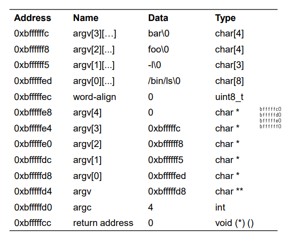
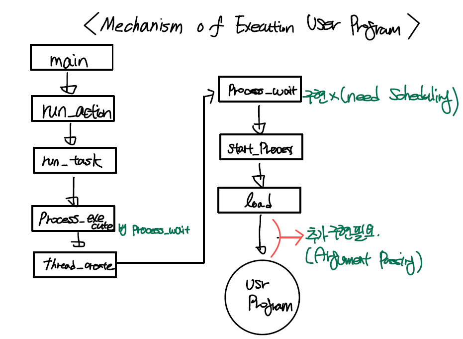

**CSED312 OS Lab 2 - User Program**
================

**Design Report**
----------------

<div style="text-align: right"> 20180085 송수민 20180373 김현지 </div>

------------------------------

# **Introduction**

이번 프로젝트의 목표는 주어진 Pintos 코드를 수정하여 User program이 실행될 수 있도록 하는 것이다. User program 실행을 위해 아래의 사항들을 구현해야 한다.

1. Argument passing
2. Process terminate messages
3. System call
4. Denying writes to executables

------------------------------

# **I. Anaylsis on Current Pintos system**

본 Lab 2에서는 PintOS의 User Program에 대해 주어진 과제를 수행한다.
주어진 과제를 수행하기 전 현재 pintOS에 구현되어 있는 system을 알아보자.

## **Process Execution Procedure**
먼저 PintOS의 Process Execution Procedure을 분석해보자.

Project 1을 구현 할 때, Linux Shell에서 "pintos -q run alarm-single"과 같은 명령어로 프로그램을 실행시킨다. 이처럼 프로그램을 실행시키는데에는 직접적인 프로그램명도 있지만 부수적으로 붙는 옵션들이 존재한다. PintOS에서는 이러한 argument를 어떻게 다루고, process를 execution하게 되는지 그 과정을 알아보고자 한다.

PintOS의 main program이 시작되는 init.c의 main함수이다.

```cpp
/* threads/init.c */
/* Pintos main program. */
int
main (void)
{
  char **argv;

  /* Clear BSS. */  
  bss_init ();

  /* Break command line into arguments and parse options. */
  argv = read_command_line ();
  argv = parse_options (argv);
  
  ...
  
  /* Run actions specified on kernel command line. */
  run_actions (argv);

  /* Finish up. */
  shutdown ();
  thread_exit ();
}
```

> main에서 command line을 읽고 이를 argument와 option으로 나눈다. 이렇게 만들어진 argv에 대해 run_actions()이 호출된다.

그렇다면 run_action()이 어떤 함수인지를 보자.

```cpp
/* threads/init.c */
/* Executes all of the actions specified in ARGV[] up to the null pointer sentinel. */
static void
run_actions (char **argv) 
{
  /* An action. */
  struct action 
    {
      char *name;                       /* Action name. */
      int argc;                         /* # of args, including action name. */
      void (*function) (char **argv);   /* Function to execute action. */
    };

  /* Table of supported actions. */
  static const struct action actions[] = 
    {
      {"run", 2, run_task},
#ifdef FILESYS
      {"ls", 1, fsutil_ls},
      {"cat", 2, fsutil_cat},
      {"rm", 2, fsutil_rm},
      {"extract", 1, fsutil_extract},
      {"append", 2, fsutil_append},
#endif
      {NULL, 0, NULL},
    };
  ...
  
}

/* Runs the task specified in ARGV[1]. */
static void
run_task (char **argv)
{
  const char *task = argv[1];
  
  printf ("Executing '%s':\n", task);
#ifdef USERPROG
  process_wait (process_execute (task));
#else
  run_test (task);
#endif
  printf ("Execution of '%s' complete.\n", task);
}
```

> run_action()은 parameter로 넘겨받은 argument에 대해 action을 수행하는 함수이다. user program을 실행하게 되면, run 'user program'이 수행됨에 따라 argc는 2가 되는 것이고, 이에 따른 run_task가 호출된다. run_task에서는 run을 통해 task로 user program라는 인자가 넘어온 상태이고, 이 task에 대한 process_execute와 process_wait함수가 호출되는 형태이다.

process_wait()과 process_execute()의 코드를 살펴보도록 하자.

  ```cpp
  /*userprog/process.c*/
  int
  process_wait (tid_t child_tid UNUSED) 
  {
    return -1;
  }
  ```

  > process wait의 경우 child process가 종료될때까지 대기하도록 하는 함수이다. 하지만 현재 pintOS에는 이 부분이 구현이 되어있지 않고 -1만 return하게 구현된 상태이다.

  ```cpp
   /*userprog/process.c*/
  tid_t process_execute (const char *file_name) 
  {
    char *fn_copy;
    tid_t tid;

    /* Make a copy of FILE_NAME.
     Otherwise there's a race between the caller and load(). */
    fn_copy = palloc_get_page (0);
    if (fn_copy == NULL)
      return TID_ERROR;
    strlcpy (fn_copy, file_name, PGSIZE);

    /* Create a new thread to execute FILE_NAME. */
    tid = thread_create (file_name, PRI_DEFAULT, start_process, fn_copy);
    if (tid == TID_ERROR)
      palloc_free_page (fn_copy); 
    return tid;
}
  ```

> 위 method에서는 file_name을 전체를 넘기는 부분은 존재하지만, file_name을 token으로 자르는 부분은 존재하지 않는다. 이것을 통해 유추할 수 있듯이, 현재 pintOS에는 argument passing이 구현되어 있지 않다. 관련된 내용은 Argument Passing Implement부분에서 구체적으로 후술하겠다. 추가적으로, 이는 Process termination message를 구현할 때도 영향을 미치므로 전체적인 구현 순서를 고려할 필요가 있다.
>  
> 다시한번 "pintos -q run alarm-single"을 예로 들면, [pintos, -q, run, alarm-single]과 같이 구분되어 pintos는 thread_create의 file_name에 넣어 넘겨주는 것이 합리적일 것이다. Argument들은 처리가 안되었는데, thread_create()의 4번째 인자를 보면 fn_copy이다. 이는 file_name, 즉 전체 명령어를 의미하고, start_process()의 인자가 될 것이므로 start_process에 넘어가는 file_name은 전체 명령어이다. 전체 명령어른 넘겼으므로 이후에 인자들을 처리 할 가능성이 생겼다.

다음으로는 Process를 시작하는 함수인 start_process()를 보자.

  ```cpp
  static void start_process (void *file_name_)
  {
    char *file_name = file_name_;
    ...
    success = load (file_name, &if_.eip, &if_.esp);

    /* If load failed, quit. */
    palloc_free_page (file_name);
    if (!success) 
    thread_exit ();
    ...
  ```

> 위 method를 보면 load에서도 전체 명령어를 넘긴다. 밑에 if(!success) 코드를 보았을 때, load가 넘겨주는 값이 0이면 thread_exit을 call하는 것과 주석을 보아 load에서 0이 아닌 값을 return하면 load가 성공, 즉 실행이 성공되었다는 것을 유추할 수 있다. 더불어, load에서 argument들을 처리할 것이라는 것을 예측할 수 있다.

그렇다면 load() 함수를 자세히 분석해보자.

```cpp
  /*userprog/process.c*/
  /* Loads an ELF executable from FILE_NAME into the current thread.
   Stores the executable's entry point into *EIP
   and its initial stack pointer into *ESP.
   Returns true if successful, false otherwise. */
bool
load (const char *file_name, void (**eip) (void), void **esp) 
{
  struct thread *t = thread_current ();
  struct Elf32_Ehdr ehdr;
  struct file *file = NULL;
  off_t file_ofs;
  bool success = false;
  int i;

  /* Allocate and activate page directory. */
  t->pagedir = pagedir_create ();
  if (t->pagedir == NULL) 
    goto done;
  process_activate ();

  /* Open executable file. */
  file = filesys_open (file_name);
  if (file == NULL) 
    {
      printf ("load: %s: open failed\n", file_name);
      goto done; 
    }

  /* Read and verify executable header. */
  ...

  /* Read program headers. */
  ...

  /* Set up stack. */
  if (!setup_stack (esp))
    goto done;

  /* Start address. */
  *eip = (void (*) (void)) ehdr.e_entry;

  success = true;

 done:
  /* We arrive here whether the load is successful or not. */
  file_close (file);
  return success;
}
  }
  ```

> load를 보면 pagedir_create라는 함수를 통해 user process의 page table을 생성하고, filesys_open이라는 method를 통해 실행하고자 하는 프로그램의 이름으로 실행가능한 파일을 open한다. 그 다음에는 ELF header정보를 읽어오고, esp와 eip setting을 한다.
>  
> process_activate()는 context switch가 일어남에 따라 현재 process의 page table을 activate하는 함수이다.
>  
> setup_stack()는 stack을 setting 해주는 것인데, 설명을 보면 0~esp의 크기의 stack을 setting 해준다. esp는 현재 가리키고 있는 stack pointer이며 이는 setup_stack에서 PHYS_BASE인 default 값으로 설정된다. 이 stack에 argument들을 넣어서 esp를 이용하여 함수들이 필요한 인자를 사용하게 구현하면 될 것이다. pintOS 문서를 참고하면, 이 stack은 위에서 아래로 자라는 것을 알 수 있다. 따라서, arguments을 stack에 넣을 때 esp를 줄여가면서 넣으면 될 것이다. 넣는 순서, 사이즈 등은 아래 사진을 참고하여 같은 방향으로 구현하고자 한다.




- 코드 분석 결과 전체적인 User Program 실행 방법은 아래 그림과 같다. 구현이 필요한 일부 부분에 대한 구간도 표시를 해놓았다.


## **System Call Procedure**
이번엔 PintOS의 System Call Procedure을 분석해보자.

System Call은 User Program의 Kernel 영역 접근을 위해 호출되는 kernel이 제공하는 interface이며, 이는 System Call Handler를 통해 이루어진다. System Call이 호출되면 kernel mode로 변환되며 kernel이 대신 해당 작업을 수행하고, 이후 다시 user mode로 변환되어 작업을 이어나간다.

먼저 이번 Project에서 다루어야할 System Call에는 어떤 종류가 있는지 System call number list를 통해 알아보자

```cpp
/* lib/syscall-nr.h */

/* System call numbers. */
enum 
  {
    /* Projects 2 and later. */
    SYS_HALT,                   /* Halt the operating system. */
    SYS_EXIT,                   /* Terminate this process. */
    SYS_EXEC,                   /* Start another process. */
    SYS_WAIT,                   /* Wait for a child process to die. */
    SYS_CREATE,                 /* Create a file. */
    SYS_REMOVE,                 /* Delete a file. */
    SYS_OPEN,                   /* Open a file. */
    SYS_FILESIZE,               /* Obtain a file's size. */
    SYS_READ,                   /* Read from a file. */
    SYS_WRITE,                  /* Write to a file. */
    SYS_SEEK,                   /* Change position in a file. */
    SYS_TELL,                   /* Report current position in a file. */
    SYS_CLOSE,                  /* Close a file. */
...
```

위의 13개의 System Call이 이번 Project2에서 다루어야하는 부분이며, 해당 기능들에 대한 함수는 아래의 user/syscall.c에 구현되어있다.

```cpp
/* lib/user/syscall.h*/
/* Projects 2 and later. */
void halt (void) NO_RETURN;
void exit (int status) NO_RETURN;
pid_t exec (const char *file);
int wait (pid_t);
bool create (const char *file, unsigned initial_size);
bool remove (const char *file);
int open (const char *file);
int filesize (int fd);
int read (int fd, void *buffer, unsigned length);
int write (int fd, const void *buffer, unsigned length);
void seek (int fd, unsigned position);
unsigned tell (int fd);
void close (int fd);
```

그 예시로 exec를 이용하여 설명해보겠다.

```cpp
/* lib/user/syscall.c*/
pid_t
exec (const char *file)
{
  return (pid_t) syscall1 (SYS_EXEC, file);
}
```

> syscall의 함수는 매우 간단하게 구현되어있으며, 후술할 syscall macro에 system call number와 parameter인 file을 argument로 넘겨주는 것이 전부이다.

위에서 사용된 syscall1은 아래와 같은 형태로 정의되어있다.

```cpp
/**/
/* Invokes syscall NUMBER, passing argument ARG0, and returns the
   return value as an `int'. */
#define syscall1(NUMBER, ARG0)                                           \
        ({                                                               \
          int retval;                                                    \
          asm volatile                                                   \
            ("pushl %[arg0]; pushl %[number]; int $0x30; addl $8, %%esp" \
               : "=a" (retval)                                           \
               : [number] "i" (NUMBER),                                  \
                 [arg0] "g" (ARG0)                                       \
               : "memory");                                              \
          retval;                                                        \
        })
```

> 이때 Number는 위에서 언급한 System call number를 의미하며, Arg0는 exec 함수의 parameter가 한 개이기 때문에 이를 담기 위한 값이다. system call number를 invoke하고, arg들은 user stack에 push한다. 여기서 $0x30은 kernel공간의 interrupt vector table에서 system call handler의 주소를 의미한다.
>  
> syscall1은 arg가 1개인 경우에 대한 정의이며, arg개수에 따라 syscall0-3으로 나누어 사용하면 된다.

현재 pintOS의 system call handler인 syscall_handler()는 아래의 코드를 보다시피 아무것도 구현되어있지 않다. 이번 Project에서 user program이 요하는 기능을 user stack의 정보를 통해 수행할 수 있도록 해당 함수에 기능을 구현하여야 한다.

```cpp
/*userprog/syscall.c*/
static void
syscall_handler (struct intr_frame *f UNUSED) 
{
  printf ("system call!\n");
  thread_exit ();
}
```

## **File System**
마지막으로 PintOS의 File System을 분석해보자.

먼저 PintOS의 file system에서 사용되는 struct를 보도록하자.
아래는 PintOS의 file의 구조체이다.

```cpp
/* filesys/file.c */
/* An open file. */
struct file 
{
  struct inode *inode;        /* File's inode. */
  off_t pos;                  /* Current position. */
  bool deny_write;            /* Has file_deny_write() been called? */
};
```

> inode : file system에서 file의 정보를 저장한다. </br>
> pos : file을 read 또는 write하는 cursor의 현재 postion을 의미한다. </br>
> deny_write : file의 write가능 여부를 표시하는 boolean 변수이다.

</br>

inode는 아래와 같은 정보를 저장하고 있는 구조체이다.

```cpp
/* filesys/inode.c */
/* In-memory inode. */
struct inode 
{
  struct list_elem elem;              /* Element in inode list. */
  block_sector_t sector;              /* Sector number of disk location. */
  int open_cnt;                       /* Number of openers. */
  bool removed;                       /* True if deleted, false otherwise. */
  int deny_write_cnt;                 /* 0: writes ok, >0: deny writes. */
  struct inode_disk data;             /* Inode content. */
};
```

inode의 data를 정의하는 data type인 inode_disk라는 구조체이다.

```cpp
/* filesys/inode.c */
/* On-disk inode. Must be exactly BLOCK_SECTOR_SIZE bytes long. */
struct inode_disk
{
  block_sector_t start;               /* First data sector. */
  off_t length;                       /* File size in bytes. */
  unsigned magic;                     /* Magic number. */
  uint32_t unused[125];               /* Not used. */
};
```

> inode의 data는 inode_disk 구조체의 형태로 저장되어있으며, inode_disk는 저장한 data의 start부분의 sector의 index와, 그 file의 크기인 length를 저장하여 inode에 저장된 data를 정의하고 있다.

</br>

다음은 filesys에 포함된 다양한 함수를 보도록 하자.

```cpp
/* Creates a file named NAME with the given INITIAL_SIZE.
   Returns true if successful, false otherwise.
   Fails if a file named NAME already exists,
   or if internal memory allocation fails. */
bool
filesys_create (const char *name, off_t initial_size) 
{
  block_sector_t inode_sector = 0;
  struct dir *dir = dir_open_root ();
  bool success = (dir != NULL
                  && free_map_allocate (1, &inode_sector)
                  && inode_create (inode_sector, initial_size)
                  && dir_add (dir, name, inode_sector));
  if (!success && inode_sector != 0) 
    free_map_release (inode_sector, 1);
  dir_close (dir);

  return success;
}
```

> filesys_create는 파일 이름이 name이고 크기가 initial_size인 file을 만드는 함수이다. </br>
> 간단히 내부를 보면 inode_sector를 선언하고 해당 sector에 대해 free_map_allocate함수를 이용하여 할당한다. 이후 inode_create함수를 이용하여 initial_size로 inode의 data length를 initialize하고 file system device의 sector에 새 inode를 쓴다. 이렇게 만들어진 inode에 대해 해당 sector가 파일명이 name인 file을 dir에 추가하는 과정을 통해 file이 create됨을 알 수 있다.

```cpp
/* Opens the file with the given NAME.
   Returns the new file if successful or a null pointer
   otherwise.
   Fails if no file named NAME exists,
   or if an internal memory allocation fails. */
struct file *
filesys_open (const char *name)
{
  struct dir *dir = dir_open_root ();
  struct inode *inode = NULL;

  if (dir != NULL)
    dir_lookup (dir, name, &inode);
  dir_close (dir);

  return file_open (inode);
}
```

> filesys_open는 파일 이름이 name인 file을 여는 함수이다. </br>
> dir_lookup을 통해 파일명이 name인 inode를 찾고, 해당 inode를 file_open하는 구조로 이루어져있다.

```cpp
/* Deletes the file named NAME.
   Returns true if successful, false on failure.
   Fails if no file named NAME exists,
   or if an internal memory allocation fails. */
bool
filesys_remove (const char *name) 
{
  struct dir *dir = dir_open_root ();
  bool success = dir != NULL && dir_remove (dir, name);
  dir_close (dir); 

  return success;
}
```

> filesys_remove는 파일 이름이 name인 file을 삭제하는 함수이다. </br>
> dir_remove을 통해 파일명이 name인 inode를 찾아 삭제하는 구조로 이루어져있다.

User Program이 File System로부터 load되거나, System Call이 실행됨에 따라 file system에 대한 code가 필요하다. 하지만, 이번 과제의 초점은 file system을 구현하는 것이 아니기 때문에 이미 구현되어있는 pintOS의 file system의 구조를 파악하고 적절히 사용할 수 있도록 하여야 한다. pintOS 문서에 따르면 filesys에 해당하는 코드는 수정하지 않는 것을 권장하고 있으므로, 구현에 있어 주의하도록 한다.

그렇다면 각 thread가 이러한 file들에 어떻게 접근하고 사용하는 것은 어떻게 이루어질까?
이때 File Descriptor라는 개념이 사용된다. File Descriptor(fd)란 thread가 file을 다룰 때 사용하는 것으로, thread가 특정 file에 접근할 때 사용하는 추상적인 값이다. fd는 일반적으로 0이 아닌 정수값을 가지며 int형으로 선언된다.
thread가 어떤 file을 open하면 kernel은 사용하지 않는 가장 작은 fd값을 할당한다. 이때, fd 0, 1은 각각 stdin, stdout에 기본적으로 indexing되어있으므로 2부터 할당할 수 있다.
그 다음 thread가 open된 파일에 System Call로 접근하게 되면, fd값을 통해 file을 지칭할 수 있다.
각각의 thread에는 file descriptor table이 존재하며 각 fd에 대한 file table로의 pointer를 저장하고 있다. 이 pointer를 이용하여 file에 접근할 수 있게 되는 것이다.

현재 PintOS의 코드에는 이러한 부분이 구현되어있지 않다. 이번 Project에서 thread의 file 접근에 대한 기능을 수행할 수 있도록 fd에 대한 부분을 구현하여야 한다.

</br>

# **II. Process Termination Messages**
## **Solution**

User Program이 종료되면, 종료된 Process의 Name과 어떠한 system call로 종료 되었는지에 대한 exit code를 출력한다. 출력 형식은 다음과 같다
  
  ```cpp
  printf("%s: exit(%d\n)",variable_1, variable_2)
  ```

>위 형식에서 variable_1은 Process의 Name이고, variable_2는 exit code 이다. 위는 Prototype으로 변수가 지정될 수 도 있고 directly하게 function을 call할 수도 있다. 각 요소를 어떻게 불러올지에 대해 알아보자.
### 1. Process Name
Process Name은 process_execute(const char *file_name)에서 시작된다.

  ```cpp
  /*userprog/process.c*/
  tid = thread_create (file_name, PRI_DEFAULT, start_process, fn_copy);
  ```

>process_execute에서 보면 *file_name을 parameter로 넘겨 받는다. 이를 thread를 생성할 때 argument로 넘기는데, thread structure에서 char name이라는 변수에 process Name을 저장한다. 즉, Process Name을 얻으려면 해당 thread에서 name을 얻어오는 method를 작성하면 된다.

### 2. Exit Code
 PintOS Document에서 구현해야 할 System call 중 exit을 보면 선언이 다음과 같이 되어 있다.

  ```cpp
  void exit(int status)
  ```

> Parameter인 status가 exit code이므로 exit안에서 exit code를 직접적으로 다룰 수 있다. 또한, thread.c의 thread_exit을 보면 thread_exit에서 process_exit을 call하는 것을 보아 종료 method call 순서는 thread_exit -> process_exit임을 알 수 있다. thread_exit은 system call : exit을 받으면 이 과정 중에서 실행 될 것이므로, exit method에서 위 형식의 message를 출력하는 것이 용이할 것이다.

## **Brief Algorithm**
System call : void exit(int status)에서 message를 출력한다. message에 담길 정보 중 process name은 thread structure에서 받아오는 method 하나를 구현하고 exit code는 exit에 넘겨준 status를 사용한다. 이때, 주의할 점으로는 kernel thread가 종료되거나 halt가 발생한 경우에는 process가 종료된 것이 아니므로 위 메세지를 출력하지 않아야 하는데 이 경우는 애초에 다른 exit()을 호출하지 않기 때문에 해결 된 issue이다.

## **To be Added & Modified**

- void exit(int status)
  > Termination message를 출력하는 code를 추가한다.

- char* get_ProcessName(struct thread* cur)
  > 종료되는 thread의 Name을 받아오는 method를 추가한다.

</br>

# **III. Argument Passing**
## **Analysis**
I에서 분석한 Process Execution Procedure에서 언급했듯, PintOS에도 명령어를 통해 프로그램을 수행할 수 있도록 argument를 나누고 실행시키기 위해 처리하는 과정인 Argument Passing 기능이 필요하고, 이를 구현하고자 한다.

## **Solution**
process_execute에서 시작하여 file_name 중 첫 token을 thread_create의 첫번째 인자로 넘겨준다. file_name 전체를 start_process에 넘기고 load를 call한다. load에서도 마찬가지로 file_name의 첫 token을 file에 넣어주고 나머지 arguments들은 stack이 setup 되고 나서 별도의 method에서 stack에 넣는다.

## **To be Added & Modified**

- tid_t process_execute(const char *file_name)
  > thread structure의 member인 name에 넣는 부분을 수정한다.

- bool load(const char *file_name, void (**eip) (void), void **esp)
  > filesys_open에서 넘겨주는 인자를 수정하고, setup_stack 이후에 stack에 arguments를 넣는 method를 추가한다.

- void putArguments(char* file_name, void **esp)
  > 위에서 언급한 setup_stack 이후 넣는 추가 method이다. file_name을 넘겨 받아 arguments의 개수, 값, 주소를 파악하여 esp를 조정하면서 넣어야 하는 값을 stack에 넣어준다.

</br>

# **IV. System Call**

## **Analysis**

I에서 분석한 System Call Procedure에서 언급했듯, system call을 수행할 수 있도록 그 handler를 구현하여야한다. syscall macro를 통해 user stack에 push된 system call argument들에 대한 정보를 통해 system call을 수행한다. 이때 stack에 입력된 정보들을 읽기 위해 stack pointer를 통해 argument를 pop하고, 해당 system call number에 대한 기능을 수행하는 과정을 구현하여야한다.

## **Solution**

system call handler를 구현하기에 앞서 먼저 user stack에 담긴 argument를 pop하는 함수(getArguments())를 구현하여야한다. 또한, esp주소가 valid한지 확인하기 위한 함수(is_addr_valid())를 구현하여야한다. 마지막으로, 가장 중요한 system call에 해당하는 기능에 대한 구현이 이루어져야한다.

### **Implement the following system calls**

**1. void halt(void)**

    shutdown_power_off() 함수를 호출하여 PintOS를 종료하는 함수.

**2. void exit(int status)**
    
    현재 실행중인 user program을 종료하고, 해당 status를 kernel에 return하는 함수.
    current thread를 종료하고, parent process에 해당 status를 전달한다.
    
**3. pid_t exec(const char * cmd_line)**
    
    cmd_line에 해당하는 이름의 program을 실행하는 함수.
    program 실행을 위해 thread_create를 통해 child process생성하고 자식과 부모와의 관계를 thread 구조체에 저장해둔다. 만약 program 실행을 실패할 경우 -1를 return하고, 성공할 경우에는 새로 생성된 process의 pid를 return한다. 이 system call에 대해 synchronization이 보장되어야한다. 이를 위해 child process에 대한 semaphore생성이 필요하다.

**4. int wait (pid_t pid)**

    pid값을 가진 child process가 종료될 때까지 기다리는 함수.
    thread에 저장된 child_list에서 pid와 동일한 child thread를 찾고, 해당 thread가 종료될 때까지 wait한다.
    이 system call에 대해 synchronization이 보장되어야한다. 이를 위해 wait process에 대한 semaphore생성이 필요하다.
    wait에 성공하였을 경우 child_list에서 해당 thread를 삭제하고, exit status를 return한다.
    반면, 아래와 같이 wait에 실패하거나, 올바르지 않은 호출일 경우 -1을 return한다.
    - 이미 종료된 child를 parent가 기다리게 되는 경우
    - pid가 direct child가 아닐 경우 (즉, 자신이 spawn한 child가 아닐 경우)
    - 이미 해당 pid에 대해 과거에 wait를 호출하여 기다리고 있을 경우 

**5. bool create(const char * file, unsigned initial_size)**

    파일명이 file인 file을 새로 만드는 함수. 해당 file의 size는 initial_size로 initialize해준다. 성공시 true를, 실패시 false를 return한다.

**6. bool remove(const char * file)**

    파일명이 file인 file을 삭제하는 함수. 파일의 open/close 여부에 관계없이 삭제 가능하며, open된 파일을 삭제할 경우 다시 close할 수 없다. 성공시 true를, 실패시 false를 return한다.

**7. int open(const char * file)**

    파일명이 file인 file을 open하고, file descriptor가 file을 가리키게 하는 함수.
    성공할 경우 file descriptor값을 return하고, 실패시 -1를 return한다.
    앞에서 언급하였듯, file descriptor의 0과 1은 stdin, stdout으로 indexing 되어있으므로 2부터 사용하지 않은 가장 작은 숫자를 할당하도록 한다. 

**8. int filesize(int fd)**

    File Descriptor를 통해 open된 file의 size를 return하는 함수.

**9. int read(int fd, void * buffer, unsigned size)**

    Open된 file의 file descriptor에서 size byte만큼 읽고 buffer에 내용을 저장하는 함수.
    fd로 0이 주어질 경우, stdin을 의미하며 이는 keyboard input을 통해 입력받아야한다. 따라서 input_getc() 함수를 이용해 입력된 내용을 buffer에 저장하고 입력된 byte를 return한다.
    fd가 0이 아닐 경우, 해당 file descriptor에 해당하는 file을 file_read함수를 통해 읽고 그 읽은 byte를 return한다.
    읽기에 성공하였을 경우 read한 byte를 return하지만, 실패하였을 경우 -1을 return한다.
    파일을 읽는 동안 다른 thread가 파일에 접근하지 못하도록 file_lock을 acquire하고, 작업이 끝나면 release한다.

**10. int write(int fd, const void * buffer, unsigned size)**

    Open된 file의 file descriptor에서 buffer에 내용을 size byte만큼 쓰는 함수.
    fd로 1이 주어질 경우, stdout을 의미하며 이는 console output을 통해 출력하여야한다. 따라서 putbuf() 함수를 이용해 buffer에 저장된 내용을 console에 입력하고 입력된 byte를 return한다.
    fd가 1이 아닐 경우, 해당 file descriptor에 해당하는 file에 file_write함수를 통해 쓰고 그 쓴 byte를 return한다.
    쓰기에 성공하였을 경우 write byte를 return하지만, 실패하였을 경우 -1을 return한다.  
    파일을 쓰는 동안 다른 thread가 파일에 접근하지 못하도록 file_lock을 acquire하고, 작업이 끝나면 release한다.

**11. void seek (int fd, unsigned position)**
  
    Open된 file의 file descriptor에서 읽거나 쓸 다음 byte를 position만큼 이동시키는 함수.

**12. unsigned tell (int fd)**

    Open된 file의 file descriptor에서 읽거나 쓸 다음 byte의 position을 return하는 함수.

**13. void close (int fd)**

    File Descriptor를 통해 file을 close하는 함수. 관련된 file descriptor의 상태도 변경해주어야한다.

## **To be Added & Modified**

- struct thread

  > 1. fd에 대한 file table로의 pointer를 저장하는 이중포인터 (struct file** file_descriptor_table) </br>
  > 2. 자식 프로세스의 list (struct list child_list) </br> 
  > 3. 위 list를 관리하기 위한 element (struct list_elem child_elem) </br> 
  > 4. exec()에서 사용되는 semaphore (struct semaphore sema_child) </br> 
  > 5. wait()에서 사용되는 semaphore (struct semaphore sema_wait) </br>
  > 6. thread의 status를 저장하는 변수 (int status)

- userprog/syscall.c
  > file에 접근해 있는 동안 다른 thread가 접근하지 못하도록 lock하기 위한 변수를 추가한다. (struct lock file_lock)

- void getArguments()(int *arg, void* sp, int cnt)
  > stack pointer(sp)로부터 cnt만큼의 argument를 stack에서 pop하여 *arg에 저장하는 변수

- bool is_addr_valid(void* addr)
  >입력된 주소값이 user memory에 해당하는 valid한 함수인지 확인하는 함수이다

- syscall_handler (struct intr_frame *f UNUSED)

  ```cpp
  /*userprog/syscall.c*/
  static void
  syscall_handler (struct intr_frame *f UNUSED) 
  {
      if(is_addr_valid(f->esp)) {
        switch (*(int*)f->esp) {
          case SYS_HALT : sys_halt(); break;
          case SYS_EXIT : getArguments(); sys_exit((int)argv[0]); break;
          .
          .
          case SYS_CLOSE : ...
          default : sys_exit(-1); //invalid syscall number
        }
      } else sys_exit(-1);
  }
  ```

  > esp 주소가 valid한지 확인하고, 유효하다면 system call number에 따라 switch문으로 나누어 syscall 함수를 실행한다.


# **V. Denying Writes to Executables**

## **Analysis**
해당 문제는 수업시간에 진행한 Reader-Writer Problem(CSED312 Lecture Note 4: Synchronization 2; p.33~34)과 같은 맥락이다. 실행중인 파일에서 Writer가 파일을 변경한다면 예상치 못한 결과를 얻을 수 있다. Mutex를 직접 구현하여 과제를 수행하려 했으나 pintOS에 내제되어 있는 유용한 method가 있어 이를 이용하여 구현하고자 한다.

  ```cpp
  /* Prevents write operations on FILE's underlying inode
   until file_allow_write() is called or FILE is closed. */
  void file_deny_write (struct file *file) 
  {
    ASSERT (file != NULL);
    if (!file->deny_write) 
    {
      file->deny_write = true;
      inode_deny_write (file->inode);
    }
  }

  /* Re-enables write operations on FILE's underlying inode.
   (Writes might still be denied by some other file that has the
   same inode open.) */
  void file_allow_write (struct file *file) 
  {
    ASSERT (file != NULL);
    if (file->deny_write) 
    {
      file->deny_write = false;
      inode_allow_write (file->inode);
    }
  }
  ```

> 위 method의 주석을 보면, file_deny_write는 말 그대로 write를 거부하는 method이다. File struct에 deny_write라는 boolean value가 있는데, file_deny_write가 call 되었다면 해당 값을 true로 assign하고, file_allow_write를 call하면 해당 값이 false로 assign된다. 즉, 이를 이용하여 일종의 Mutex를 실현하고 잇는 것이다. 그렇다면 이 method를 call해야 할 때는 언제인지 알아보자. File write를 막아야 할 때는 이미 load를 하였을 때이다. 따라서 load에서 file을 open하고 나서 file_deny_write()를 호출한다. 이후, file이 close 될 때 이를 풀어주기 위해 file_allow_write를 호출해준다.

## **Solution**
File이 open되는 지점인 load 함수에서 file_deny_write()를 호출하고, file이 close 될 때 file_allow_write를 호출해 다시 권한을 넘긴다.

## **To be Added & Modified**

- bool load (const char *file_name, void (**eip) (void), void **esp)
  > file이 open 후 시점에 file_deny_write를 호출한다.
- file_allow_write는 이미 file_close안에 구현되어 있다.

  ```cpp
  void file_close (struct file *file) 
  {
    if (file != NULL)
      {
        file_allow_write (file);
        inode_close (file->inode);
        free (file); 
      }
  }
  ```