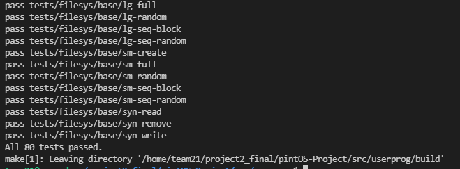

**CSED312 OS Lab 2 - User program**
================

**Final Report**
----------------

<div style="text-align: right"> 20180085 송수민 20180373 김현지 </div>

------------------------------

# **I. Implementation of Argument Passing**

## **Analysis**

현재 pintOS의 Argument Passing은 구현되어 있지 않다. pintos –q run ‘echo x’ 라는 명령어를 입력하면 ‘echo x’라는 argument들을 메모리에 쌓아 process가 이를 활용할 수 있도록 해야하는데, 이러한 기능이 구현되어 있지 않은 것이다. 궁극적으로, 이번 Implementation of Argument Passing은 문자열로 들어온 total argument들을 공백을 기준으로 구분해서 메모리에 쌓는 것을 목적으로 한다. 

## **Brief Algorithm**

- Process_execute()가 실행되면 file_name의 첫 부분(token이라 명명)을 thread_create에 첫번째 인자로 넘긴다. 
- Start_process에서 load를 호출한다. 이때, load의 첫번째 parameter를 file_name의 첫번째 token을 넘긴다.
- Load()가 success를 return하면 construct_esp(file_name,&if_.esp)를 호출하여 메모리에 argument, address of argument, return address를 넣는다.


## **Implementation**

- process_execute() 변경 사항이다.
  
```cpp
tid_t process_execute (const char *file_name) 
{ 
...
  char *fn_copy_2 = palloc_get_page(0);
  strlcpy(fn_copy_2,file_name,PGSIZE);
  char *name;
  char *remain;
  name = strtok_r(fn_copy_2," ",&remain);
  /* Create a new thread to execute FILE_NAME. */

  tid = thread_create (name, PRI_DEFAULT, start_process, fn_copy);
  palloc_free_page(fn_copy_2);
...
}
```
> thread_create()를 호출 할 때 기존에는 file_name 전체를 parameter로 넘겼다. 이는 후에 exit system call 시에 name을 불러오는데 잘못된 name을 불러오기 때문에 변경하여야 한다. 변경방법은 직접적으로 file_name을 접근하지 못하게 하기 위해 fn_copy_2를 새로 동적할당하여 file_name을 복사하고 이를 strtok_r을 이용하여 문자열을 잘라 첫 부분만 thread_create에 넘긴다. 이후, OS는 효율적인 메모리 관리가 중요하므로 필요없는 fn_copy_2를 해제한다.

- process_start() 변경 사항이다.

```cpp
static void start_process (void *file_name_)
{
...
  char* fn_copy_1 = palloc_get_page(0);
  char* cmd_name;
  char *remain;
  strlcpy(fn_copy_1,file_name,PGSIZE);
  cmd_name = strtok_r(fn_copy_1," ",&remain);
  /* Initialize interrupt frame and load executable. */
  memset (&if_, 0, sizeof if_);
  if_.gs = if_.fs = if_.es = if_.ds = if_.ss = SEL_UDSEG;
  if_.cs = SEL_UCSEG;
  if_.eflags = FLAG_IF | FLAG_MBS;
  success = load (cmd_name, &if_.eip, &if_.esp);
  //printf("value of success : %d\n",success);
  if(success){
    construct_esp(file_name, &if_.esp);
  }
  //printf("Checking Memory\n");
  //hex_dump(if_.esp, if_.esp, PHYS_BASE - if_.esp,true);
  palloc_free_page(fn_copy_1);
}
```
> process_execute()의 변경사항과 동일하다. load에서 프로그램 명으로 disk에서 file을 open하기 때문에, 'echo x'에서 'echo'만을 넘겨주어야 한다. 동일한 방법으로 load 첫번째 인자에 cmd_name을 넘겨준다. 이후, load가 true를 return하면 성공적으로 load되었다는 것이므로 construct_esp()를 호출하여 Stack에 argument를 쌓아준다. 이때 넘기는 parameter는 전체 file_name과 esp이다. construct_esp()가 종료되면 fn_copy_1을 해제한다.

- construct_esp()의 구현이다.
  
```cpp
void construct_esp(char *file_name, void **esp) {

  int argc;
  char ** argv;
  char *name;
  char *token;
  char *remain;
  int i;
  int len;
  
  name = palloc_get_page(PAL_ZERO);

  argc = 0;
  strlcpy(name, file_name, strlen(file_name) + 1);
  for(token = strtok_r(name, " ", &remain); token != NULL; token = strtok_r(NULL, " ", &remain)){
    if(*token != " ")
      argc++;
  }

  i = 0;
  argv = (char **)palloc_get_page(PAL_ZERO);
  strlcpy(name, file_name, strlen(file_name) + 1);
  for (token = strtok_r(name, " ", &remain); i < argc; token = strtok_r(NULL, " ", &remain)) {
    len = strlen(token);
    argv[i++] = token;
  }

  for (i = argc - 1; i >= 0; i--) {
    len = strlen(argv[i]);
    *esp -= len + 1;
    strlcpy(*esp, argv[i], len + 1);
    argv[i] = *esp;
  }

  *esp -= ((uint32_t)*esp) % 4;
  
  *esp -= 4;
  **(uint32_t **)esp = 0;
  
  for (i = argc - 1; i >= 0; i--) {
    *esp -= 4;
    **(uint32_t **)esp = argv[i];
  }
  
  *esp -= 4;
  **(uint32_t **)esp = *esp + 4;

  *esp -= 4;
  **(uint32_t **)esp = argc;
  *esp -= 4;
  **(uint32_t **)esp = 0;

  palloc_free_page(name);
  palloc_free_page(argv);
}
```
> 메모리에 argument를 쌓는 전체적인 과정은 esp를 직접 조작하여 쌓는다. Stack은 위에서 아래로 자라나므로, -연산을 이용하여 조작한다. Stored_file_name은 file_name을 이용하여 직접 token을 조작하면 원본이 바뀔 수 있기 때문에 만든 일종의 temp value이다. Size를 256으로 고정한 이유는 pintos document에서 256보다 큰 argument는 들어올 수 없다고 제한을 걸어놓았고, 이를 이용해도 된다는 글에서 착안했다.
> 먼저, strlcpy를 통해 복사를 하여 argument의 숫자부터 count한다. 이후 argc를 이용하여 argv를 argc만큼 동적할당한다. 다시 strlcpy를 통해 token을 잘라 이번엔 argv[i]에 해당 argument를 넣는다. 이 argv를 이용하여 stack에 쌓는다. 현재 esp는 setup_stack의 초기화로 인해 PHYS_BASE이며 아래로 자라나기 때문에 가장 마지막 argument부터 차례로 넣어준다. for문에서 argc-1가 initial value인 이유이다. 
> 4의 배수에 맞게 word alignment를 실행한 이후 다시 argv[i]의 address를 차례로 넣어준다. Argv의 address를 넣고 argc, fake return address까지 넣어준 후 argv를 해제해준다.
> 
```cpp
bfffffe0  00 00 00 00 02 00 00 00-ec ff ff bf f9 ff ff bf |................|
bffffff0  fe ff ff bf 00 00 00 00-00 65 63 68 6f 00 78 00 |.........echo.x.|
```

- 위는 hex_dump(if_.esp, if_.esp, PHYS_BASE – if_.esp, true)를 실행한 결과이다. 알맞게 stack에 쌓인 것을 확인 할 수 있다.

# **II. Implementation of System Calls & Process Termination Messages**

## **Analysis**

> 현재 pintOS에는 System call을 발생시키는 도구는 구현이 되어있지만, System call이 발생해서 각각의 수행해야 하는 기능은 구현되어 있지 않다. 현재 구현되어 있는 사항은 각 System call의 Number와 Argument 개수에 따른 System call의 Macro 뿐이다.

```cpp
/**/
/* Invokes syscall NUMBER, passing argument ARG0, and returns the
   return value as an `int'. */
#define syscall1(NUMBER, ARG0)                                           \
        ({                                                               \
          int retval;                                                    \
          asm volatile                                                   \
            ("pushl %[arg0]; pushl %[number]; int $0x30; addl $8, %%esp" \
               : "=a" (retval)                                           \
               : [number] "i" (NUMBER),                                  \
                 [arg0] "g" (ARG0)                                       \
               : "memory");                                              \
          retval;                                                        \
        })

/*userprog/syscall.c*/
static void
syscall_handler (struct intr_frame *f UNUSED) 
{
  printf ("system call!\n");
  thread_exit ();
}

```
> 이를 이용해서 기능을 구현해야 한다. Syscall macro를 통해 User stack에 push된 System call Argument들에 대한 정보를 통해 System call을 수행한다. 이때 stack에 입력된 정보들을 읽기 위해 stack pointer를 통해 Argument를 pop하고, 해당 System call number에 대한 기능을 수행하는 과정을 구현하여야한다.

## **Implementation**

- thread에 새로운 변수들을 추가하였다.
```cpp
/*threads/thread.h*/
struct thread
{
    ... 
    #ifdef USERPROG
        /* Owned by userprog/process.c. */
        uint32_t *pagedir;                  /* Page directory. */

        struct thread *parent; /* parent process의 descriptor */
        struct list_elem child_elem; /* child list element */
        struct list child_list;/* child list */
        bool isLoad;/* process의 프로그램 메모리 load 유무 */
        bool isExit;/* process가 종료 유무 확인 */
        struct semaphore sema_exit;/* exit semaphore */
        struct semaphore sema_load;/* load semaphore */
        int exit_status;/* exit 호출 시 종료 status */

        struct file **fd_table; /* file descriptor table */
        int fd_nxt;             /* 현재 table에 존재하는 fd값의 최대값 + 1 */

        struct file *file_run;   /* 현재 실행중인 file 추가 */
    #endif
    ...
};

/*threads/thread.c*/
tid_t
thread_create (const char *name, int priority,
               thread_func *function, void *aux) 
{
  ...

  #ifdef USERPROG
    t->parent = thread_current(); /* parent process 저장 */
    sema_init(&(t->sema_exit), 0); /* exit semaphore 0으로 초기화 */
    sema_init(&(t->sema_load), 0); /* load semaphore 0으로 초기화 */
    t->isExit = false; /* process가 종료되지 않음 */
    t->isLoad = false; /* 프로그램이 로드되지 않음 */
    list_push_back(&(running_thread()->child_list), &(t->child_elem));/* child list에 추가 */

    t->fd_nxt = 2;/* fd 값 초기화(0,1은 표준 입력,출력) */
    t->fd_table = palloc_get_page(PAL_ZERO); /* File Descriptor table에 메모리 할당 */
    if(t->fd_table == NULL) return TID_ERROR;
  #endif
  ...
}
```
> parent : 현재 생성된 Process는 thread_create를 호출한 thread_current()가 parent process이다. 따라서, 생성된 Process의 parent를 담고 있는 member variable이다.</br>
> child_elem : thread를 다루는 방식과 동일하게, child thread들을 관리하기 위해 넣은 member이다. </br>
> child_list : thread를 다루는 방식과 동일하게, child thread들을 담고 있는 member이다.</br>
> isLoad : process의 프로그램이 메모리에 load되었는지 확인하는 변수이다.</br>
> isExit: process기 exit되었는지 확인하는 변수이다. </br>
> sema_exit : wait <-> exit 과정 중 process의 synchronization을 맞추기 위한 semaphore이다.  </br>
> sema_load : execute <-> start <-> load 과정 중 process의 synchronization을 맞추기 위한 semaphore이다.</br>
> exit_status : Parent Process가 Child Process의 종료가 어떠한 방식으로 종료되었는지 알기 위해 exit status를 담는 variable이다. 이를 바탕으로 synchornization, process termiantion message 등을 처리한다.  </br>

> fd_table : file descriptor table이다.</br>
> fd_nxt: file descriptor table의 최대값 + 1이며, fd_table에 file을 추가하는 등의 관리에 유용하게 사용된다.</br>
> file_run : 현재 실행되고 있는 file을 저장한다.</br>

### **Syscall Handler**

- syscall handler에 필요한 함수들을 구현하였다.

```cpp
bool check_address(void *addr)
{
  if(is_user_vaddr(addr)) return true;
  else return false;
}
```

> 주소 값이 user 영역에서 사용하는 address 값인지 확인하는 함수이다. 즉, 유효한 주소인지 threads/vaddr.h의 is_user_vaddr함수를 사용하여 확인한 후 그 결과를 return한다.

```cpp
void get_argument(void *esp, int *arg, int count){
  int i;
  for(i = 0; i < count; i++){
    if(!check_address(esp + 4*i)) exit(-1);
    arg[i] = *(int *)(esp + 4*i);
  }
}
```

> user stack에 있는 인자들을 kernel에 저장하는 함수이다. argument를 esp에서 pop하여 arg에 저장한다. system call마다 요구하는 개수가 달라 이를 syscall handler에서 count값을 지정하여 호출하고, 이를 통해 저장된 값을 이용하여 system call을 수행한다.

```cpp
struct thread *get_child_process (pid_t pid)
{
  struct list_elem *e;
  struct list *child_list = &thread_current()->child_list;
  struct thread *thrd;
  /* child list에 접근하여 process descriptor 검색 */
  for (e = list_begin (child_list); e != list_end (child_list); e = list_next (e))
  {
    thrd = list_entry(e, struct thread, child_elem);
    if(thrd->tid == pid) /* 해당 pid가 존재하면 process descriptor return */
      return thrd;
  }
  return NULL; /* list에 존재하지 않으면 NULL return */
}
```

> child process를 pid를 통해 검색하고 그 process descriptor를 return하는 함수이다. child_list에서 해당 pid와 같은 process descriptor를 return한다. child_list에 해당 pid가 존재하지 않을 경우 null을 return한다.

```cpp
void remove_child_process(struct thread *cp)
{
  if(cp != NULL)
  {
    list_remove(&(cp->child_elem));  /* child list에서 제거*/
    palloc_free_page(cp);           /* process descriptor 메모리 해제 */
  }
}
```

> child process를 제거하는 함수이다. 해당 child process를 list에서 제거하고, 해당 process의 메모리를 해제한다.

</br>

- 위의 함수들을 이용하여 syscall handler를 구현하였다.

```cpp
static void
syscall_handler (struct intr_frame *f ) 
{
  int argv[3];
  if (!check_address(f->esp)) exit(-1);

  switch (*(uint32_t *)(f->esp)) {
    case SYS_HALT: halt();
      break;
    case SYS_EXIT: 
      get_argument(f->esp + 4, &argv[0], 1);
      exit((int)argv[0]);
      break;
    case SYS_EXEC:
      get_argument(f->esp + 4, &argv[0], 1);
      f->eax = exec((const char*)argv[0]);
      break;
    case SYS_WAIT:
      get_argument(f->esp + 4, &argv[0], 1);
      f->eax = wait((pid_t)argv[0]);
      break;
    case SYS_CREATE:
      get_argument(f->esp + 4, &argv[0], 2);
      f->eax = create((const char*)argv[0], (unsigned)argv[1]);
      break;
    case SYS_REMOVE:
      get_argument(f->esp + 4, &argv[0], 1);
    f->eax=remove((const char *)argv[0]);
      break;
    case SYS_OPEN:
      get_argument(f->esp + 4, &argv[0], 1);
      f->eax = open((const char *)argv[0]);
      break;
    case SYS_FILESIZE:
      get_argument(f->esp + 4, &argv[0], 1);
    f->eax = filesize(argv[0]);
      break;
    case SYS_READ:
      get_argument(f->esp + 4, &argv[0], 3);
      f->eax = read((int)argv[0], (void*)argv[1], (unsigned)argv[2]);
      break;
    case SYS_WRITE:
      get_argument(f->esp + 4, &argv[0], 3);
      f->eax = write((int)argv[0], (const void*)argv[1], (unsigned)argv[2]);
      break;
    case SYS_SEEK:
      get_argument(f->esp + 4, &argv[0], 2);
    seek(argv[0],(unsigned)argv[1]);
      break;
    case SYS_TELL:
      get_argument(f->esp + 4, &argv[0], 1);
    f->eax = tell(argv[0]);
      break;
    case SYS_CLOSE:
      get_argument(f->esp + 4, &argv[0], 1);
    close(argv[0]);
      break;
    default :
      exit(-1);
  }
```
> 각각의 syscall number에 맞게 switch문을 통해 syscall을 수행하도록 구현하였고, 주어진 number가 아닐 경우 exit(-1)을 호출하였다. system call마다 요구하는 argument를 get_argument 함수를 이용하여 stack에서 pop하고, return할 값이 있을 경우 stack에 다시 push하였다. 각각의 system call에 대한 부분은 아래에서 자세히 알아보도록 하자.

#### **halt**

```cpp
void
halt (void) 
{
  shutdown_power_off(); /* shutdown_power_off()를 사용하여 pintos 종료 */
}
```

> pintos를 종료시키는 System Call이다. shutdown_power_off()를 이용하여 종료시킨다.

#### **exit**

```cpp
void
exit (int status) {
  printf("%s: exit(%d)\n", thread_name(), status);  /* process 종료 메시지 출력, 출력 양식: “process name: exit status” */
  thread_current()->exit_status = status;   
  thread_exit ();   /* thread 종료 */
}
```

> 현재 process를 종료시키는 System Call이다. Process Termination Message를 출력하고, 해당 thread의 종료시 status를 저장하는 exit_status에 status를 저장한 후 thread를 종료한다. </br>
> Process Termination Message는 “process name: exit(status)”의 형태로 출력한다.

```cpp
/*threads/thread.c*/
void
thread_exit (void) 
{
  ...
  #ifdef USERPROG
    process_exit ();
  #endif
  ...
  thread_current()->isExit = true; /* process descriptor에 process 종료를 알림 */
  if(thread_current() != initial_thread){
    sema_up(&(thread_current()->sema_exit)); /* parent process의 대기 상태 이탈 */
  }
  ...
}
```

> thread_exit()에서는 process_exit()를 통해 process를 종료시킨다. System Call wait()에서 parent process는 child가 종료될 때까지 대기하게 되는데, 이때 sema_down해 뒀던 sema_exit이라는 semaphore를 sema_up하면서 대기하고 있던 parent process에 child의 종료를 알린다.

#### **exec**

```cpp
pid_t
exec (const char *file)
{
  struct thread *child;
	pid_t pid = process_execute(file);  /* process_execute() 함수를 호출하여 child process 생성 */
  if(pid == -1)  return -1;
	child = get_child_process(pid); /* 생성된 child process의 process descriptor를 검색 */
  sema_down(&(child->sema_load));   /* child process의 프로그램이 load될 때까지 대기 */   
	if(child->isLoad) return pid;   /* 프로그램 load 성공 시 child process의 pid return */ 
	else		return -1;          /* 프로그램 load 실패 시 -1 return */

}
```

> child process를 생성하고 프로그램을 실행시키는 System Call이다. userprog/process.c의 process_execute()를 통해 child process를 생성하고, sema_load라는 semaphore를 이용하여 child process의 응용 프로그램이 load 될 때까지 대기한다. </br>
> 프로그램 load 성공 시 생성된 process의 pid 값을 return, 실패 시 -1을 return한다.

```cpp
static void
start_process (void *file_name_)
{
  ...
  success = load (cmd_name, &if_.eip, &if_.esp);

  thread_current()->isLoad = success;
  if(success){
    construct_esp(file_name, &if_.esp);
  }
  sema_up(&thread_current()->sema_load);
  ...
}
```
> child process관점에서 봤을때 start process에서 program이 load된 이후, load가 성공 여부를 isLoad에 저장하고, sema_load를 다시 sema_up하여 parent의 대기를 해제시킨다.

#### **wait**

```cpp
int
wait (pid_t pid)
{
  return process_wait(pid); /* process_wait() 사용하여, child process가 종료 될 때까지 대기 */
}
```

> child process가 모두 종료될 때까지 대기하는 System Call이다. userprog/process.c의 process_wait()를 통해 child_process의 종료까지 대기한다.

```cpp
/*userprog/process.c*/
int
process_wait (tid_t child_tid) 
{
  struct thread *parent = thread_current();
  struct thread *child;
  
  int status;
  struct list_elem *e;
  if (!(child = get_child_process(child_tid))) return -1;
  for(e = list_begin(&parent->child_list);e!=list_end(&parent->child_list);e=list_next(e))
  {
    child = list_entry(e,struct thread, child_elem);
    if(child_tid == child->tid)
    {
      sema_down(&child->sema_exit);
      status = child->exit_status;
      remove_child_process(child);

      return status;
    }
  }
  return -1;
}
```

> wait System call에서 호출하는 process_wait이다. 기본적으로 어떠한 process가 Wait을 호출한다는 것은 그 process의 Child process의 종료를 기다리는 것이다. 따라서 parent 포인터를 thread_current()로 지정한다. Parent의 Child list를 순회하기 전에, 넘겨 받은 tid 값으로 이 process가 존재하는지 여부를 판단해서 있으면 순회 code로 진입하고, 없다면 -1을 return한다. For문으로 list에 있는 child_list에 있는 thread를 비교한다. 비교 기준은 그 child process가 가지고 있는 tid값을 비교한다. 일치한다면 child process의 exit semaphore를 down시켜 종료 될때까지 기다린다. 이후 exit에서 sema_up을 호출하면 이 process는 종료된 것이므로 이 child process가 어떠한 과정으로 종료되었는지에 대한 정보를 담고있는 status 값을 저장한다. 이후, 해당 child process를 제거한다. 저장한 status 값을 return 하며, 해당하는 child가 없다면 마찬가지로 -1을 return 한다. process_wait()은 기본적으로 system call : wait에서 쓰이지만, process_execute에서 마지막 부분에도 call하게 code를 작성하였다. 그 이유는 child process가 load되기 전에 parent process가 dying된다면 이 child process에 대하여 처리를 해줄 수가 없다. 이는 OS에서 메모리 누수를 못 잡는 것이 되므로 이를 처리해주기 위해 process_execute에서 wait을 호출한다.

#### **create**

```cpp
bool
create (const char *file, unsigned initial_size)
{
  if(file == NULL) exit(-1);    
  return filesys_create(file, initial_size); /* file 이름과 크기에 해당하는 file 생성 및 성공 여부 return */
}
```

> file을 생성하는 System Call이다. 생성할 file의 이름과 크기에 대한 정보를 통해 filesys/filesys.c의 filesys_create함수를 이용하여 file을 생성하고, 성공 여부를 return한다. file이 null일 경우 exit을 통해 process를 종료한다.

#### **remove**

```cpp
bool
remove (const char *file)
{
  return filesys_remove(file);  /* file 이름에 해당하는 file을 제거 및 성공 여부 return*/
}
```

> file을 삭제하는 System Call이다. 삭제할 file에 대한 정보를 통해 filesys/filesys.c의 filesys_remove함수를 이용하여 file을 삭제하고, 성공여부를 return한다.

#### **open**

```cpp
int
open (const char *file)
{
  int fd;
  struct file *f;

  if (file == NULL) exit(-1);

  lock_acquire(&lock_file); 
  f = filesys_open(file); /* file을 open */
  if (strcmp(thread_current()->name, file) == 0) file_deny_write(f);  /*ROX TEST*/
  
  if(f != NULL) { 
    fd = process_add_file(f);     /* 해당 file 객체에 file descriptor 부여 */
    lock_release(&lock_file);
    return fd;                        /* file descriptor return */
  }
  lock_release(&lock_file);
  return -1; /* 해당 file이 존재하지 않으면 -1 return */
}
```

> file을 open할 때 쓰이는 system call이다. 넘어온 file명이 NULL Pointer라면 exit(-1)을 호출하여 비정상적으로 종료되었음을 알린다. 이번 과제에서 본 조는 한 process가 file에 대해 점유하고 있으면 다른 process는 접근을 못하게 하는 방식으로 synchronization을 구현하였다. 따라서, lock_file이라는 lock으로 lock을 얻는다. 이후, file을 찾아 open하고, 해당 file 객체에 file descriptor를 부여한다. 이후, lock을 해제하고 해당 file descriptor을 return한다. file이 없다면 lock을 해제하고 -1을 return 하여 비정상적으로 종료되었음을 알린다.

```cpp
int process_add_file (struct file *f)
{
  int fd = thread_current()->fd_nxt;

  thread_current()->fd_table[fd] = f; /* file 객체를 file descriptor table에 추가*/
  thread_current()->fd_nxt++; /* file descriptor의 최대값 1 증가 */

  return fd;  /* file descriptor return */
}
```

> 위에서 쓰이는 추가로 구현한 method이다. 해당 thread의 file descriptor table에 file 객체를 추가하고, file descriptor의 count를 1 늘려준다. 이후, file desrciptor를 return한다.

#### **filesize**

```cpp
int
filesize (int fd) 
{
  struct file *f;
  if((f = process_get_file(fd))) { /* file descriptor를 이용하여 file 객체 검색 */
    return file_length(f); /* 해당 file의 길이를 return */
  }
  return -1;  /* 해당 file이 존재하지 않으면 -1 return */
}
```

> filesize를 얻는 System call이다. 아래에서 후술 할 process_get_file을 이용해 file 객체를 검색한다. 검색을 통해 얻은 file의 length를 return한다. 해당 file이 없으면 -1을 return한다.

```cpp
struct file *process_get_file(int fd)
{
  struct file *f;

  if(fd < thread_current()->fd_nxt) {
    f = thread_current()->fd_table[fd]; /* file descriptor에 해당하는 file 객체를 return */
    return f;
  }
  return NULL; /* 없을 시 NULL return */
}
```

> thread structure에 구현되어 있는 file descriptor table을 이용하여 file을 찾는다. 위에서 open system call 과정 중 file을 추가 할 때 fd_nxt의 최대값을 1씩 늘려주었으므로, 이를 기준으로 fd_nxt보다 작으면 해당 fd는 vaild한 값이므로 file descriptor table에서 file 객체를 return한다. 존재하지 않는다면 NULL을 return 한다.

#### **read**

```cpp
int
read (int fd, void *buffer, unsigned size)
{
  int read_size = 0;
  struct file *f;
  if(!check_address(buffer))
    exit(-1);
    
  lock_acquire(&lock_file); /* file에 동시 접근이 일어날 수 있으므로 Lock 사용 */

  if(fd == 0) {   /* file descriptor가 0일 경우(STDIN) 키보드에 입력을 버퍼에 저장 후 버퍼의 저장한 크기를 return */
    unsigned int i;
    for(i = 0; i < size; i++) {
       if (((char *)buffer)[i] == '\0') break;
    }
    read_size = i;
  } else {
    if((f = process_get_file(fd))) 
      read_size = file_read(f,buffer,size);  /* file descriptor가 0이 아닐 경우 file의 데이터를 크기만큼 저장 후 읽은 바이트 수를 return */
  }

  lock_release(&lock_file); /* file에 동시 접근이 일어날 수 있으므로 Lock 사용 */

  return read_size;
}
```

> file의 data를 read하는 System Call이다. 이 System call은 먼저 file에 대한 lock을 얻는다. 다른 process의 접근을 막기 위해서이다. 두 가지 케이스로 나뉘는데, file descripotr가 0 (표준 입력)인 경우와 그것이 아닌 경우이다. 표준입력인 경우 키보드 입력을 버퍼에 저장 후, '\0'이 들어온다면 break를 걸어 저장된 버퍼의 크기를 return 한다. 만약 표준 입력이 아닌 다른 file descriptor라면 해당 file을 읽은 후 읽은 크기 만큼 저장 한다음 이를 return 한다. 모두 return 이전에 점유하고 있는 lock을 해제한다.

#### **write**

```cpp
int
write (int fd, const void *buffer, unsigned size)
{
  int write_size = 0;
	struct file *f;

	lock_acquire(&lock_file); /* file에 동시 접근이 일어날 수 있으므로 Lock 사용 */

	if(fd == 1) { /* file descriptor가 1일 경우(STDOUT) 버퍼에 저장된 값을 화면에 출력후 버퍼의 크기 return (putbuf() 이용) */
		putbuf(buffer, size);
		write_size = size;
	} else {    /* file descriptor가 1이 아닐 경우 버퍼에 저장된 데이터를 크기만큼 file에 기록후 기록한 바이트 수를 return */
		if((f = process_get_file(fd)))
			write_size = file_write(f,(const void *)buffer, size);
	}

	lock_release(&lock_file); /* file에 동시 접근이 일어날 수 있으므로 Lock 사용 */

	return write_size;
}
```

> file의 data에 write하는 System Call이다. 이 System call도 read와 마찬가지로 표준 출력 (file descriptor = 1)과 그 외의 경우로 나뉜다. 표준 출력일 경우 버퍼에 저장된 값을 화면에 출력한 후 버퍼의 크기를 return한다. 표준 출력이 아니라면 버퍼에 저장된 데이터 크기만큼 해당 file에 기록 후 기록 된 크기를 return한다. 모두 return 이전에 점유하고 있는 lock을 해제한다.

#### **seek**

```cpp
/*userprog/syscall.c*/
void
seek (int fd, unsigned position) 
{
  struct file *f = process_get_file(fd); /* file descriptor를 이용하여 file 객체 검색 */

  if(f != NULL) file_seek(f, position); /* 해당 열린 file의 위치를 position만큼 이동 */
}

/*filesys/file.c*/
void
file_seek (struct file *file, off_t new_pos)
{
  ASSERT (file != NULL);
  ASSERT (new_pos >= 0);
  file->pos = new_pos;
}

```

> 열린 file의 위치를 이동시키는 System Call이다. file descriptor에 해당하는 file을 찾고, file.c에 구현되어있는 file_seek을 이용하여 해당 file의 위치를 이동시킨다.

#### **tell**

```cpp
/*userprog/syscall.c*/
unsigned
tell (int fd) 
{
  struct file *f = process_get_file(fd); /* file descriptor를 이용하여 file 객체 검색 */

  if(f != NULL) return file_tell(f); /* 해당 file의 위치를 return */
  return 0; 
}

/*filesys/file.c*/
off_t
file_tell (struct file *file) 
{
  ASSERT (file != NULL);
  return file->pos;
}

```

> 열린 file의 위치를 알려주는 System Call이다. file descriptor에 해당하는 file을 찾고, file.c에 구현되어있는 file_tell을 이용하여 해당 file의 위치를 return한다.

#### **close**

```cpp
void
/*userprog/syscall.c*/
close (int fd)
{
  process_close_file(fd);
}
```

> 열린 file을 닫는 System Call이다. userprog/process.c의 process_close_file()함수를 통해 file descriptor에 해당하는 file을 닫고, 해당 file descriptor를 제거한다.

```cpp
/*userprog/process.c*/
void process_close_file(int fd)
{
  struct file *f;

  if((f = process_get_file(fd))) {  /* file descriptor에 해당하는 file을 닫음 */
    file_close(f);
    thread_current()->fd_table[fd] = NULL;  /* file descriptor table 해당 엔트리 초기화 */
  }
}

/*filesys/file.c*/
void
file_close (struct file *file) 
{
  if (file != NULL)
    {
      file_allow_write (file);
      inode_close (file->inode);
      free (file); 
    }
}
```

> File Descriptor에 해당하는 file을 process_get_file함수로 찾은 후, file_close하여 이를 닫는다. 이후, File Descriptor table에 해당 엔트리를 null로 초기화시켜준다.

이렇게 Syscall Handler를 완성하여 System Calls을 해결할 수 있다.

# **III. Implementation of Denying Write to Executables**

## **Analysis**
해당 문제는 실행 중인 file에 write하는 것을 방지하는 것을 목표로 한다. 수업시간에 진행한 Reader-Writer Problem(CSED312 Lecture Note 4: Synchronization 2; p.33~34)과 같은 맥락이다. 실행중인 file에서 Writer가 file의 데이터를 변경한다면 예상치 못한 결과를 얻을 수 있다. Mutex를 직접 구현하여 과제를 수행하려 했으나 pintOS에 내제되어 있는 유용한 method가 있어 이를 이용하여 구현하고자 한다.

  ```cpp
  /* Prevents write operations on FILE's underlying inode
   until file_allow_write() is called or FILE is closed. */
  void file_deny_write (struct file *file) 
  {
    ASSERT (file != NULL);
    if (!file->deny_write) 
    {
      file->deny_write = true;
      inode_deny_write (file->inode);
    }
  }

  /* Re-enables write operations on FILE's underlying inode.
   (Writes might still be denied by some other file that has the
   same inode open.) */
  void file_allow_write (struct file *file) 
  {
    ASSERT (file != NULL);
    if (file->deny_write) 
    {
      file->deny_write = false;
      inode_allow_write (file->inode);
    }
  }
  ```

> 위 method의 주석을 보면, file_deny_write는 말 그대로 write를 거부하는 method이다. File struct에 deny_write라는 boolean value가 있는데, file_deny_write가 call 되었다면 해당 값을 true로 assign하고, file_allow_write를 call하면 해당 값이 false로 assign된다. 즉, 이를 이용하여 일종의 Mutex를 실현하고 잇는 것이다. 그렇다면 이 method를 call해야 할 때는 언제인지 알아보자. File write를 막아야 할 때는 이미 load를 하였을 때이다. 따라서 load에서 file을 open하고 나서 file_deny_write()를 호출한다. 이후, file이 close 될 때 이를 풀어주기 위해 file_allow_write를 호출해준다.

## **Brief Algorithm**
File이 open되는 지점인 load 함수에서 file_deny_write()를 호출하고, file이 close 될 때 file_allow_write를 호출해 다시 권한을 넘긴다.

## **Implementation**

- load함수에서 file이 open 후 시점에 file_deny_write을 호출한다.

  ```cpp
  /*userprog/process.c*/
  struct lock lock_file;
  ...
  bool
  load (const char *file_name, void (**eip) (void), void **esp) 
  {
    ...
    lock_acquire(&lock_file); /* 락 획득 */
    /* Open executable file. */
    file = filesys_open (file_name);
    if (file == NULL) 
      {
        lock_release(&lock_file);/* 락 해제 */
        printf ("load: %s: open failed\n", file_name);
        goto done; 
      }
    
    t->file_run = file;    /* thread 구조체의 run_file을 현재 실행할 file로 초기화 */
    file_deny_write(file);  /* file_deny_write()를 이용하여 file에 대한 write를 거부 */

    lock_release(&lock_file);/* 락 해제 */
    ...
  }
  ```
  
  > file을 open한 후 file_deny_write를 함수를 호출하여, 해당 file이 close되기 전까지는 write가 되지 않도록 구현하였다. 이때 이 과정은 Atomic하게 이루어져야하기 때문에 lock_file이라는 lock을 생성하여 file open과 file_deny_write의 과정을 lock으로 묶어준다.

- file을 close하는 file_close 함수안에 이미 file_allow_write하는 부분이 구현되어있어 이 부분은 추가적인 구현을 하지 않아도 된다.

  ```cpp
  void file_close (struct file *file) 
  {
    if (file != NULL)
      {
        file_allow_write (file);
        inode_close (file->inode);
        free (file); 
      }
  }
  ```

# **Discussion**
## 1. ROX TEST
> rox test는 앞의 Denying Write to Executables의 한 부분이다. 즉, 실행파일에 write가 되지 않도록 막아야하는 것이 문제인데, 이 test가 쉽게 통과되지 않았다. 즉, 처음 design했던 load와 file close에서만 allow와 deny를 처리해주면 해결될 것이라 생각했지만 해결되지 않아, file write의 근본인 file open쪽을 보았다.

```cpp
int
open (const char *file)
{
  int fd;
	struct file *f;

  if (file == NULL) exit(-1);

  lock_acquire(&lock_file); 
  f = filesys_open(file);
  if (strcmp(thread_current()->name, file) == 0) file_deny_write(f);  /*ROX TEST*/
  
	if(f != NULL) { 
		fd = process_add_file(f);
    lock_release(&lock_file);
		return fd;
	}
  lock_release(&lock_file);
	return -1;
}
```

> 위와 같이 file의 이름과 thread의 이름이 같을 경우, 즉 현재 해당 file이 실행 중일 경우 write가 되면 안되기 때문에, 이 file에 대해 deny write를 걸어주었다. 이렇게 deny를 처리하고 나니, rox test를 통과할 수 있었다.

## 2. Sync-read & write Test
> 다른 test들과 달리 처리가 잘 안되던 test 중 하나이다. 특히 처리가 어려웠던 이유는 read / write test라 해서 read / write system call 쪽을 디버깅 하고 있었지만 실제 문제는 오히려 wait에서 발생했기 때문이다. wait <-> exit에서 synchronization 문제를 해결하기 위해 semaphore를 이용하였는데, 계속 semaphore를 넣을 때 list에 대한 kernel panic이 발생하였다. 이유는 exec에서 sema_down이였다. Semaphore를 down시킬 때 그 주체가 잘못 되었던 것이다. Down 시켜야 하는 process는 child process인데, exec를 부른 Parent process에서 Semaphore를 down 시키려니 kernel panic이 발생하였다. sema_down을 child로 지정하여 처리하였더니 pass처리가 되었다. 아래는 해당 코드이다.

```cpp
pid_t
exec (const char *file)
{
  struct thread *child;
	pid_t pid = process_execute(file);
  if(pid==-1)  return -1;
	child = get_child_process(pid);
  sema_down(&(child->sema_load)); // &thread_current()->sema_load 에서 child process로 변경     
	if(child->isLoad) return pid;
	else		return -1;
}
```

## 3. Multi_oom Test
> Multi-oom Test는 이번 Pintos Project 2에서 가장 까다로웠던 Test였다. 이 Test의 목적은 Userprogram을 실행하고 마무리하면서 메모리 누수가 존재하는지에 대한 검사이다. Project 1과 다르게 이번 project에서는 동적 할당을 사용하기 시작했다. Argument pass에서 해당 size만큼 메모리를 할당하거나, file name을 넘기는 과정에서 원본에 영향을 미치지 않게 하기 위해 file name size만큼의 메모리르 할당받는 등의 경우가 발생했다. 운영체제의 주요한 역할 중 하나는 메모리 관리이다. 따라서, 본 과제를 진행하는 동안 run-time에서 할당한 메모리는 해제하여야 구현하는 목적에 부합할 것이다. malloc을 사용한 경우에는 free를 사용하고, palloc_get_page를 사용한 경우에는 palloc_free_page를 사용하여 메모리를 해제하였다. 그러나, 언급한 내용들은 코드 상으로 보이는 issue이고, 보이지 않는 issue는 처리가 안되어서 test를 통과하지 못하였다. 이 과정에서도 Project 1과 마찬가지로 Concurreny Issue는 정말 까다롭다고 생각이 들었다. Test output을 보면 child process에 관한 오류가 계속 발생하였다. 원인을 분석한 결과, Parent process에서 create를 호출하여 child process를 만들고 load하는 과정에서 Parent Process가 먼저 dying 처리 되어버린다면, 이 Parent process에서 child process로 접근이 가능했기 때문에 child process에 대해 처리를 못해준다. 이 경우를 고려하여 따로 처리를 해줄 필요가 있었다.  

```cpp
tid_t
process_execute (const char *file_name) 
{ 
  ...
  struct thread* child;
  struct list_elem *e;
  for(e = list_begin(&thread_current()->child_list);e!= list_end(&thread_current()->child_list);e=list_next(e))
  {
    child = list_entry(e, struct thread, child_elem);
    if(child->exit_status == -1)
      return process_wait(tid);
  }
  ...
}
```
> process_execute에 마지막 부분에 위에서 언급한 case를 처리해주어 문제를 해결하였다. 결국, 위 상황에서 발생하는 case는 child process가 그대로 남아있는 경우이므로 child process에 대해 wait을 call하여 종료시키게 만들어 주었다.

## 4. Changed from Design Report
> Argument passing에서 Design Report에서는 Argument pass method를 넣는 시점을 load의 setup_stack 직후였다. 실제 구현 중에는 start_process에서 load 직후로 바꾸었는데, 이유는 start_process에 있는 struct intr_frame if_의 member들을 이용하여 처리하는 것이 좀 더 가시적이고, load는 변경사항을 만들기가 조금 까다로웠는데, start_process는 그에 비해 자유로웠기 때문이다. load의 성공 여부로 argument를 passing하는 것이 좀더 가독성을 높여준다고 생각했다.

## 5. What We have Learned
> 우리가 사용하는 개발 환경인 Linux shell에서 Program이 어떠한 방식으로 구동되는지 알게 되었다. 다른 OS 또한 같은 concept으로 이루어질 것이라고 생각하지만, Argument passing 때문에 Linux shell을 떠올리면서 구현을 한 것은 사실이다. Argument passing으로 메모리에 argument들이 적재되는 과정과 이를 활용하는 방법, system call이 발생하였을 때의 과정과 각 기능들을 알게 되었다. Memory management도 구현하면서 메모리 사용을 처음부터 잘 관리해야 문제가 발생하지 않는다고 느꼈다. 이를 처리하지 않으면 디버깅 또는 처리가 매우 까다롭기 때문에 느낀 것 같다. 더불어, 위 문제를 해결하면서 Concurrency 문제는 다시 한번 중요하며 어렵다고 생각이 들었다. 개발 및 프로그램의 설계할 때는 Concurreny에 대해 정확히 알고 있어야 유지 보수 및 구현이 용이할 것 같다.

</br>

# **Result**
서버에서 make check를 입력하여 나온 모든 test에 대한 결과값이다.



위와 같이 이번 PintOS Project 2의 모든 test를 pass한 모습을 볼 수 있다.
